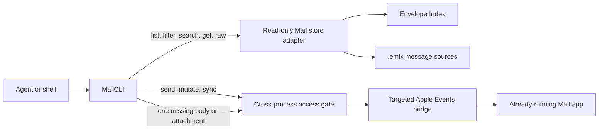

# MailCLI

Local Apple Mail access for the shell and coding agents.

[](go.mod)
[](#compatibility)
[](LICENSE)

MailCLI gives command-line tools and agents a typed interface to the accounts already configured in Apple Mail. It reads mail from Mail's local store, performs writes through the running Mail app, and never asks for Gmail, iCloud, IMAP, SMTP, OAuth, or app-specific credentials.

```bash
mailcli messages search --sender example.com --after 2026-01-01 --json
mailcli messages get --ref MESSAGE_REF --json
mailcli attachments save --message MESSAGE_REF --attachment ATTACHMENT_ID --output /absolute/path/file.pdf --json
```

## Why MailCLI

Apple Mail's scripting interface works well for targeted writes but performs poorly for large read operations. MailCLI separates those workloads.

- Lists, filters, metadata searches, message reads, raw source, and downloaded attachments use Mail's local store without Apple Events. A targeted incomplete-content fallback accepts only Mail's raw RFC 5322 source as body or MIME-part evidence.
- Body search scans the selected `.emlx` sources on demand within explicit message and byte limits. MailCLI creates no second mail index.
- Draft export, send, reply, forward, mark, move, copy, delete, and sync use serialized Apple Events against the exact running Mail process.
- Machine output uses one versioned JSON envelope with typed errors, opaque references, explicit pagination, and search coverage.
- Send attempts are durable and at most once. An uncertain outcome cannot trigger an automatic resend.

Reads of locally available content on the supported store profile add no work to the Mail process. Requesting content that Mail has not downloaded may use one targeted Apple Event. Explicit writes still require Mail.app to do the requested work. MailCLI bounds and serializes those calls so multiple agents cannot build an Apple Events queue behind the application.

## Capabilities

Run `mailcli capabilities --json` before automation. Its versioned response is the authoritative command contract for agents: command IDs, read/write class, confirmation, Mail-store and Mail.app dependencies, result states, and hard limits. Help text is for humans and must not be parsed as capability data.

| Area | Commands | Behavior |
|---|---|---|
| Accounts | `accounts list` | Lists configured accounts and sender identities |
| Mailboxes | `mailboxes list`, `mailboxes resolve` | Handles Inbox, Sent, Drafts, Archive, Junk, Trash, custom folders, and nested labels |
| Messages | `messages list`, `filter`, `search`, `get`, `raw` | Pages metadata, applies typed filters, scans bodies, and returns normalized or RFC 5322 content |
| Attachments | `attachments list`, `attachments save` | Inspects and exports received files without overwriting a destination |
| Composition | `drafts create`, `list`, `inspect`, `update`, `save`, `open`, `send`, `reconcile`, `discard` | Keeps messages reviewable before native draft export or confirmed send |
| Responses | `messages reply`, `messages forward` | Creates local reply, reply-all, and forward drafts while Mail owns native threading and quoted content |
| Organization | `messages mark`, `move`, `copy`, `delete` | Revalidates message identity before each mutation and reads back the result |
| Synchronization | `sync` | Checks all mail or synchronizes one selected account |

Run `mailcli help` for human-readable usage.

Capability discovery and local draft creation, listing, inspection, updating,
and discard bypass the Mail store and Mail.app entirely. They therefore avoid
SQLite, `plutil`, and Apple Events startup work.

## Architecture



Mail.app remains the source of truth. MailCLI has no daemon, background process, watcher, copied corpus, owned search index, or persistent cache of its own.

The store adapter opens Mail's Envelope Index with SQLite `mode=ro`, `query_only=1`, WAL participation, and a private connection cache. Before reading, it validates the store version, framework version, UUID, required schema, account catalog, mailbox mapping, and filesystem containment. Message, mailbox-cache, and external-attachment files are opened relative to one held Mail-store directory descriptor with macOS `O_NOFOLLOW_ANY`; selection, hashing, and copying remain bound to the same regular-file identity. An unknown profile fails with `unsupported_mail_store_schema` before any message query runs.

The write bridge acquires a context-aware BSD advisory lock, requires Mail to be running, and binds each request to the current Mail PID. Each invocation owns one `osascript` process group, waits for its leader, terminates any remaining owned group members, and verifies that the group is gone before releasing the gate. Cancellation first writes a private marker so the bridge can close an owned unsent compose object; only an unresponsive bridge is force-stopped after the cleanup grace period. It never launches, activates, quits, kills, or restarts Mail. A timed-out write enters `mail_recovery_required` because caller cancellation does not prove that Mail cancelled an Apple Event already accepted by the application.

See [docs/documentation.md](docs/documentation.md) for the full command, reference, cursor, draft, send, and coverage contracts.

## Compatibility

MailCLI has a deliberately narrow support target:

| Requirement | Supported value |
|---|---|
| Operating system | macOS 15.6.1 |
| Architecture | Apple silicon, `darwin/arm64` |
| Mail | Mail 16.0, build `3826.700.81` |
| Envelope Index | Store version `4`, minor version `74003` |
| Go toolchain | Go 1.27 or newer for source builds |

MailCLI fails closed when the Mail store profile changes. This protects the local database from speculative compatibility code, but it also means a new macOS or Mail release may require an explicit adapter update.

## Install

The `v1.0.2` release archive installs both the native CLI and its companion agent skill:

```bash
VERSION=1.0.2
curl -fLO "https://github.com/Christopher-Schulze/MailCLI/releases/download/v${VERSION}/mailcli_${VERSION}_darwin_arm64.tar.gz"
curl -fLO "https://github.com/Christopher-Schulze/MailCLI/releases/download/v${VERSION}/SHA256SUMS"
shasum -a 256 -c SHA256SUMS
tar -xzf "mailcli_${VERSION}_darwin_arm64.tar.gz"
"./mailcli_${VERSION}_darwin_arm64/install.sh"
command -v mailcli
mailcli version --json
```

The release installer copies the verified binary to `~/.local/bin/mailcli` and the skill to `~/.agents/skills/mailcli`. It stages and verifies both before replacing an existing installation, restores backups on failure, rejects symbolic-link destinations and unresolved backup paths, and never removes macOS security attributes. Start a new agent session after installation so the skill is discovered.

To build from source instead, install Go 1.27 or newer and the Xcode Command Line Tools for CGO:

```bash
git clone https://github.com/Christopher-Schulze/MailCLI.git
cd MailCLI
./scripts/build/install-local.sh
```

The source installer builds a native `darwin/arm64` executable and copies only the binary to `~/.local/bin/mailcli` by default. Pass an explicit destination as the first argument to install elsewhere, then install or link [`skills/mailcli`](skills/mailcli) separately when agent support is needed.

The current release binary is ad-hoc signed but not Apple-notarized because no Developer ID identity is available. A browser download can therefore be quarantined by Gatekeeper. Verify `SHA256SUMS` first; if macOS still blocks the verified binary, explicitly remove only that binary's quarantine attribute with `xattr -d com.apple.quarantine ~/.local/bin/mailcli`. The installer never performs this bypass automatically.

### Grant permissions

MailCLI uses the permissions of the process that launches it. Grant permissions to Terminal, Codex, or the relevant agent host in **System Settings > Privacy & Security**.

| Permission | Required for |
|---|---|
| Full Disk Access | Accounts, mailboxes, messages, searches, raw source, and downloaded attachments |
| Automation access to Mail | Live diagnostics, missing-content fallback, draft export, send, mutations, and sync |

Accessibility and Screen Recording are not required.

Verify the read path without contacting Mail.app:

```bash
mailcli doctor --json
```

Use the live probe only before an operation that needs Apple Events:

```bash
mailcli doctor --live --json
```

Mail must already be running. The live probe never launches it.

## Usage

### Discover accounts and mailboxes

Never guess account, mailbox, message, or attachment identifiers. Resolve them through the CLI.

```bash
mailcli accounts list --json
mailcli mailboxes list --account ACCOUNT_REF --json
mailcli mailboxes resolve --account ACCOUNT_REF --path Gesendet --json
mailcli mailboxes resolve --account ACCOUNT_REF --path Projects --path 2026 --json
```

### List, filter, and search

```bash
mailcli messages list --mailbox MAILBOX_REF --limit 25 --json
mailcli messages filter --mailbox MAILBOX_REF --read false --attachment true --json
mailcli messages search --sender example.com --after 2026-01-01 --json
mailcli messages search --query "invoice tracking number" --max-messages 50000 --json
```

List, filter, and search commands accept page sizes from 1 through 25. Continue with `data.page.next_cursor` until it is absent. Body search starts with the smallest result window needed for the requested page and grows its two-worker scan window only while candidates do not match. It reports candidate counts, scanned messages and bytes, partial sources, missing sources, bounds, and `data.page.coverage.complete`.

### Read messages and attachments

```bash
mailcli messages get --ref MESSAGE_REF --json
mailcli messages raw --ref MESSAGE_REF
mailcli attachments list --message MESSAGE_REF --json
mailcli attachments save \
  --message MESSAGE_REF \
  --attachment ATTACHMENT_ID \
  --output /absolute/non-existing/path/document.pdf \
  --json
```

`messages get` returns normalized content and completion metadata. A fallback result is complete only after MailCLI parses a full raw RFC 5322 source; failed Mail scripting properties remain explicitly incomplete. `messages raw` returns the unmodified RFC 5322 message. Attachment IDs are deterministic MIME-part paths, including during targeted fallback, while exported attachment files contain the decoded MIME-part bytes and report their media type, byte count, and SHA-256. Attachment export requires an absolute path and refuses to overwrite an existing file.

### Create and send a message

MailCLI uses local structured drafts as the review boundary. Creating or editing a local draft never sends mail.

```bash
printf '%s' '{
  "from": "me@example.com",
  "to": [{"name": "Recipient", "address": "recipient@example.com"}],
  "cc": [],
  "bcc": [],
  "subject": "Project update",
  "body": "Hello,\n\nHere is the update.\n\nBest regards\n",
  "attachments": ["/absolute/path/report.pdf"]
}' | mailcli drafts create --input - --json

mailcli drafts inspect --ref DRAFT_REF --json
mailcli drafts send --ref DRAFT_REF --confirm --json
```

Every draft JSON object must contain an explicit `body` field; an intentionally empty string is valid. Duplicate addresses across To, CC, and BCC are rejected. MailCLI records attachment size and SHA-256 when it creates or updates a draft. At send time it byte-verifies each reviewed attachment into a private snapshot, so later filesystem changes cannot alter what Mail reads.

Send results have three explicit outcomes:

| Outcome | Meaning | Next action |
|---|---|---|
| `sent_store_observed` | The matching message appeared in Sent | Complete |
| `accepted_by_mail` | Mail accepted the send, but exact Sent content was not observed in time; command exits `1` with `ok:false` and preserves `data.send_result` | Do not send again; reconcile |
| `outcome_unknown` | The caller cannot prove whether Mail accepted the operation | Do not send again; reconcile |

```bash
mailcli drafts reconcile --ref DRAFT_REF --json
```

Reconciliation only checks Sent. It cannot send the draft again. Until exact Sent evidence exists, it also exits `1` with `send_not_observed`.

### Reply, forward, and organize

```bash
printf '%s' '{"body":"Thanks, I will review this.\n"}' \
  | mailcli messages reply --message MESSAGE_REF --input - --all --json

printf '%s' '{"to":[{"address":"recipient@example.com"}],"body":"For your review.\n"}' \
  | mailcli messages forward --message MESSAGE_REF --input - --json

mailcli messages mark --ref MESSAGE_REF --read true --flagged false --json
mailcli messages move --ref MESSAGE_REF --mailbox DESTINATION_MAILBOX_REF --json
mailcli messages copy --ref MESSAGE_REF --mailbox DESTINATION_MAILBOX_REF --json
mailcli messages delete --ref MESSAGE_REF --confirm --json
mailcli sync --account ACCOUNT_REF --json
```

Reply and forward commands require a store-bound source reference and create local drafts. Before send, MailCLI revalidates the exact source in the local store, fingerprints original forward attachments from local MIME, and asks Mail to create the native compose object without redundantly fetching its full RFC source over Apple Events. Each compose phase has a hard five-snapshot budget; a second stable read-back verifies the reviewed body, native quote, recipients, and attachments. Any mismatch closes the unsent compose object and blocks `send()`.

## JSON contract

Every data-bearing command supports `--json` and returns the same top-level envelope:

```json
{
  "schema_version": 1,
  "ok": true,
  "command": "accounts.list",
  "data": {
    "accounts": []
  },
  "error": null
}
```

Exit code `0` means success, `1` means a runtime or Mail failure, and `2` means invalid CLI usage. Errors use stable machine-readable codes and actionable messages. References and cursors are opaque and bound to the current Mail store. Resolve a fresh reference after moving, copying, deleting, or synchronizing a message.

## Agent skill

The repository includes a companion skill at [`skills/mailcli`](skills/mailcli). It teaches Codex and compatible agents when to invoke MailCLI, how to paginate every mailbox, how to interpret incomplete search coverage, and when a send must never be retried.

The release installer places it at `~/.agents/skills/mailcli`, the personal skill location discovered by Codex. For a source checkout, link the repository copy manually:

```bash
mkdir -p "${HOME}/.agents/skills"
ln -s "$(pwd)/skills/mailcli" "${HOME}/.agents/skills/mailcli"
```

The link command refuses if a skill already exists at that destination. It does not overwrite an installed skill. Start a new agent session after either installation method.

## Safety model

| Guarantee | Mechanism |
|---|---|
| No provider credentials | Reuses accounts and Keychain-backed authentication already configured in Mail.app |
| No Mail database writes | Opens the Envelope Index read-only and rejects journal or schema mutations |
| No owned mail index | Searches current local sources on demand and persists no corpus |
| No broad Apple Events reads | Uses the store for enumeration and search, with fallback for one resolved incomplete message only |
| No duplicate send after timeout | Persists a send claim before invoking Mail and blocks every repeated attempt |
| No Mail.app lifecycle control | Requires the exact running Mail PID and never launches, activates, quits, kills, or restarts Mail.app |
| No residual bridge process | Waits for the owned `osascript` leader, terminates residual group members, and verifies process-group absence before command completion |
| No Apple Events backlog after uncertainty | Records the exact affected Mail PID and rejects every later live operation until that process has been replaced |
| No accidental overwrite or path substitution | Attachment export accepts only an absolute destination that does not exist; Mail-store sources reject symlinks and file-identity replacement |
| No silent incomplete search | Reports source completeness and scan bounds on every search page |

MailCLI stores only local review drafts and access-gate recovery state under `~/Library/Application Support/MailCLI`. Draft directories use mode `0700`; draft files use mode `0600`.

## Limitations

- Outbound content is reviewed plain text. Mail 16's scripting `html content` property is deprecated and does not provide reliable HTML composition.
- Mail owns native threading, quoted content, and original attachments for replies and forwards.
- Mail 16 has no reliable headless in-place editor for a persisted native draft. Continue editing the local review draft, then export it again when appropriate.
- Messages that are not fully downloaded may need one targeted Apple Events fallback. The result reports remaining missing parts instead of claiming completeness.
- Body search is bounded work over current `.emlx` sources, not an instant persistent index. Narrow account, mailbox, sender, date, or subject scope for large stores.

## Development

```bash
./scripts/tests/test.sh
./scripts/build/build.sh
./scripts/release/build-release.sh 1.0.2
MAILCLI_LIVE_TESTS=1 go test -count=1 -run '^TestLive' -v ./internal/mailstore
./scripts/tests/test-live-responsiveness.sh
```

The main gate checks every shell script's syntax and executable bit, then runs `gofmt`, module verification, Staticcheck, `go vet`, `golangci-lint`, `govulncheck`, uncached race tests, coverage, architecture regression checks, and isolated release installation tests. The release builder refuses to overwrite assets and writes the combined archive plus `SHA256SUMS` to `dist/` unless `MAILCLI_RELEASE_DIRECTORY` selects an empty absolute directory. Live tests are opt-in. Build the binary before running the responsiveness gate; it executes three bounded live probes, requires the same Mail PID, rejects residual `mailcli` or `osascript` processes and Mail-held repository handles, and verifies that the post-operation probe remains within the measured and absolute latency bounds. On the supported release host, bypassing store startup reduced process-inclusive `drafts list --json` peak RSS from 10.13-10.45 MB to 6.59-6.78 MB; this is a host-specific reference measurement, not a platform guarantee.

## License

MailCLI is available under the [MIT License](LICENSE). Copyright 2026 Christopher Schulze.
