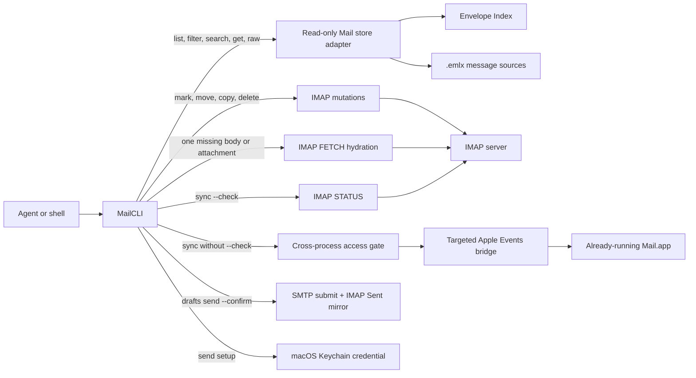

# MailCLI

Local Apple Mail access for the shell and coding agents.

[](go.mod)
[](#compatibility)
[](LICENSE)

MailCLI gives command-line tools and agents a typed interface to the accounts already configured in Apple Mail. It reads mail from Mail's local store, performs mailbox mutations over IMAP, and sends reviewed drafts autonomously over SMTP. MailCLI uses SMTP and IMAP under the hood with credentials stored in the macOS Keychain via `mailcli send setup`; it never asks for account passwords, OAuth tokens, or other credentials in chat.

```bash
mailcli messages search --sender example.com --after 2026-01-01 --json
mailcli messages get --ref MESSAGE_REF --json
mailcli attachments save --message MESSAGE_REF --attachment ATTACHMENT_ID --output /absolute/path/file.pdf --json
```

## Why MailCLI

Apple Mail's scripting interface can perform targeted mailbox mutations but performs poorly for large reads and is unsafe for composition on the verified Mail 16 host. MailCLI separates those workloads and fails closed where Mail cannot preserve reviewed content.

- Lists, filters, metadata searches, message reads, raw source, and downloaded attachments use Mail's local store without Apple Events. Incomplete-content hydration uses bounded IMAP FETCH.
- Body search scans the selected `.emlx` sources on demand within explicit message and byte limits. It decodes text parts and keeps attachment names searchable without decoding attachment payloads. MailCLI creates no second mail index.
- Mark, move, copy, and delete execute directly over IMAP using provisioned account credentials without launching Mail.app. Every mutation returns typed server-truth evidence.
- Local-store staleness is documented and honest: IMAP mutations apply immediately on the server; the local read store updates on Mail.app's next background sync. `mailcli sync --check` inspects server vs local message counts over IMAP without launching Mail.app.
- Local new, reply, reply-all, and forward drafts remain fully reviewable. `drafts send --confirm` delivers autonomously over SMTP and mirrors the message into Sent over IMAP with no Mail.app involvement; unreliable scripted save remains blocked before contacting Mail. A new draft can also be handed to Apple's visible Compose Email sharing service without sending.
- Machine output uses one versioned JSON envelope with typed errors, opaque references, explicit pagination, and search coverage.

Reads and mutations add zero work to the Mail.app process. Sending, marking, moving, copying, and deleting operate autonomously over standard SMTP and IMAP transports. Mail.app is retained solely as the local sync engine feeding the SQLite read store and for optional visible compose handoff.

## Capabilities

Run `mailcli capabilities --json` before automation. Its versioned response is the authoritative command contract for agents: command IDs, read/write class, confirmation, Mail-store and Mail.app dependencies, result states, and hard limits. Help text is for humans and must not be parsed as capability data.

| Area | Commands | Behavior |
|---|---|---|
| Accounts | `accounts list` | Lists configured accounts and bounded sender identities with explicit coverage evidence |
| Mailboxes | `mailboxes list`, `mailboxes resolve` | Handles Inbox, Sent, Drafts, Archive, Junk, Trash, custom folders, and nested labels |
| Messages | `messages list`, `filter`, `search`, `get`, `raw` | Pages metadata, applies typed filters, scans bodies, and returns normalized or RFC 5322 content |
| Attachments | `attachments list`, `attachments save` | Inspects and exports received files without overwriting a destination |
| Responses | `messages reply`, `messages forward` | Creates local reply, reply-all, and forward review drafts without opening a compose object |
| Composition | `drafts create`, `list`, `inspect`, `preview`, `edit`, `update`, `handoff`, `open`, `discard`, `prune`, `reconcile` | Manages plain, Markdown, or safe HTML drafts, prunes stale never-sent drafts, reconciles retained send claims, and opens a reviewed new draft visibly; scripted `save` remains blocked |
| Sending | `send setup`, `drafts send` | Stores an app-specific password in the Keychain once, then delivers reviewed drafts over SMTP/IMAP with `--confirm`; no Mail.app required. Short protocol phases use a 30 s budget; encoded SMTP DATA and IMAP APPEND transfers scale with message size at a 1 MiB/s floor, up to a 15 min cap |
| Synchronization | `sync` | `--check` reports server-vs-local deltas over IMAP; `--require-complete` makes incomplete checks exit 3; without `--check` asks Mail.app to synchronize |
| Maintenance | `update` | Checks GitHub, verifies a pinned Ed25519 signature plus checksum, and atomically updates the binary and companion skill |

Run `mailcli help` for the compact command overview. Focused command help accepts
`help`, `-h`, or `--help` and renders aligned long options with semantic value
names and readable defaults. The global `--json` flag may appear before, between, or after the command path; a value position such as `--query --json` remains a value.

Capability discovery, local draft management, sending, credential setup, and the unsupported native save preflight bypass the Mail store and
Mail.app entirely. Reply and forward creation read the source message's header block from the Mail store and write only local draft files.
Missing or unknown command/subcommand routes do the same.
They therefore avoid SQLite, `plutil`, and Apple Events startup work.

## Architecture



Mail.app remains the source of truth for reads; mailbox mutations execute over IMAP and sent messages are mirrored into the account's Sent mailbox over IMAP. MailCLI has no daemon, background process, watcher, copied corpus, owned search index, or persistent cache of its own.

Direct IMAP work uses a bounded pool per host, port, and username. The CLI default is two authenticated TLS connections per account, and library callers may configure one through eight with `imapclient.NewWithOptions`. LIST, STATUS, SEARCH, and FETCH may overlap on separate sessions; APPEND, STORE, COPY, MOVE, and DELETE are exclusive against reads and each other for the same account so selected-mailbox and UIDVALIDITY state cannot race. Different accounts have independent pools. Context cancellation applies while waiting for either the operation gate or a pool slot, credentials never enter pool identity, and `Close` blocks new acquisition, waits for acquired operations, then attempts LOGOUT and closes every pooled session. Separate Client values do not coordinate, so callers that split one account across Clients own cross-client mutation ordering. `imapclient.OperationContracts` and `mailcli capabilities --json` expose the same operation class, gate, session ownership, mailbox-selection, and UIDVALIDITY contract.

The store adapter opens Mail's Envelope Index with SQLite `mode=ro`, `query_only=1`, WAL participation, and a private connection cache. Before reading, it validates the store version, framework version, UUID, required schema, account catalog, mailbox mapping, and filesystem containment. Message, mailbox-cache, and external-attachment files are opened relative to one held Mail-store directory descriptor with macOS `O_NOFOLLOW_ANY`; selection, hashing, and copying remain bound to the same regular-file identity. An unknown profile fails with `unsupported_mail_store_schema` before any message query runs.

The write bridge acquires a context-aware BSD advisory lock, requires Mail to be running, verifies the exact `com.apple.mail` process identity, and binds each request to that PID. Before any potentially mutating Apple Event, it durably pre-arms an exact-PID recovery marker; if that write cannot be synchronized, the operation does not start. SIGINT, SIGTERM, and context cancellation also write a private bridge marker so the script can close an owned unsent compose object; only an unresponsive bridge is force-stopped after the cleanup grace period. Each invocation owns one `osascript` process group, reaps it, and verifies that the group is gone before releasing the gate. A definite completion clears the pre-armed state; an incomplete operation or caller crash leaves it latched as `mail_recovery_required` until the affected Mail process has been replaced. Read probes, search, raw reads, sync triggers, and Automation denial do not create false recovery state. MailCLI never launches, activates, quits, kills, or restarts Mail.

See [docs/documentation.md](docs/documentation.md) for the full command, reference, cursor, draft, send, and coverage contracts.

## Compatibility

MailCLI has a deliberately narrow support target:

| Requirement | Supported value |
|---|---|
| Operating system | macOS 15.6.1 |
| Architecture | Apple silicon, `darwin/arm64` |
| Mail | Mail 16.0, build `3826.700.81` |
| Envelope Index | Store version `4`, minor version `74003` |
| Go toolchain | Go 1.27 or newer for source builds |

MailCLI fails closed when the Mail store profile changes. This protects the local database from speculative compatibility code, but it also means a new macOS or Mail release may require an explicit adapter update.

## Install

The published `v1.3.0` archive installs both the native CLI and its companion agent skill:

```bash
VERSION=1.3.0
curl -fLO "https://github.com/Christopher-Schulze/MailCLI/releases/download/v${VERSION}/mailcli_${VERSION}_darwin_arm64.tar.gz"
curl -fLO "https://github.com/Christopher-Schulze/MailCLI/releases/download/v${VERSION}/SHA256SUMS"
curl -fLO "https://github.com/Christopher-Schulze/MailCLI/releases/download/v${VERSION}/SHA256SUMS.sig"
shasum -a 256 -c SHA256SUMS
tar -xzf "mailcli_${VERSION}_darwin_arm64.tar.gz"
"./mailcli_${VERSION}_darwin_arm64/install.sh"
command -v mailcli
mailcli version --json
```

The release installer copies the verified binary to `~/.local/bin/mailcli` and the skill to `~/.agents/skills/mailcli`. It stages and verifies both before any live rename, records a durable transaction manifest, commits each target with identity-checked rollback, and deterministically recovers interrupted installs before accepting a new one. It rejects unsafe parent or destination symlinks and unresolved backup paths, and never removes macOS security attributes. Start a new agent session after installation so the skill is discovered.

After the first installation, update both components with:

```bash
mailcli update
mailcli update --json
```

Interactive terminals show bounded progress while MailCLI checks GitHub, verifies the exact `SHA256SUMS` bytes against its pinned Ed25519 release key, downloads the named `darwin/arm64` asset, verifies its digest and Mach-O code signature, and runs the rollback-safe installer. JSON mode emits exactly one envelope and no animation. Concurrent updaters are serialized, and every metadata, asset, checksum, signature, and redirect URL is restricted to exact trusted GitHub hosts, HTTPS with the default port, and at most 10 redirects. Shell startup injection variables are removed from the installer environment. The installer owns a private process group; cancellation sends `SIGTERM` so its rollback trap runs, then force-cleans and verifies any resistant descendant before returning.

To build from source instead, install Go 1.27 or newer and the Xcode Command Line Tools for CGO:

```bash
git clone https://github.com/Christopher-Schulze/MailCLI.git
cd MailCLI
./scripts/build/install-local.sh
```

The source installer builds a native `darwin/arm64` executable and copies only the binary to `~/.local/bin/mailcli` by default. Pass an explicit destination as the first argument to install elsewhere, then install or link [`skills/mailcli`](skills/mailcli) separately when agent support is needed.

The published release binary is ad-hoc signed but not Apple-notarized because no Developer ID identity is available. A browser download can therefore be quarantined by Gatekeeper. Verify `SHA256SUMS` first; if macOS still blocks the verified binary, explicitly remove only that binary's quarantine attribute with `xattr -d com.apple.quarantine ~/.local/bin/mailcli`. The installer never performs this bypass automatically.

### Grant permissions

MailCLI uses the permissions of the process that launches it. Grant permissions to Terminal, Codex, or the relevant agent host in **System Settings > Privacy & Security**.

| Permission | Required for |
|---|---|
| Full Disk Access | Accounts, mailboxes, messages, searches, raw source, and downloaded attachments |
| Automation access to Mail | Live diagnostics, `drafts open`, `sync` without `--check`, and fallback listing when the store open fails |
| None | Sending (`send setup`, `drafts send`), message mutations (`mark`, `move`, `copy`, `delete`), and `sync --check`; they use IMAP/SMTP with Keychain credentials and need no Automation permission, though the first keychain read may show one consent prompt |

Accessibility and Screen Recording are not required.

Verify the read path without contacting Mail.app:

```bash
mailcli doctor --json
```

Use the live probe only before an operation that needs Apple Events:

```bash
mailcli doctor --live --json
```

Mail must already be running. The live probe never launches Mail or creates, saves, or sends a message. It verifies the exact process identity and performs one read-only Apple Events version query. Mail 16 retains some hidden outgoing backends even after `close saving no`, so a healthcheck must never manufacture a compose object.

## Usage

### Discover accounts and mailboxes

Never guess account, mailbox, message, or attachment identifiers. Resolve them through the CLI.

```bash
mailcli accounts list --json
mailcli mailboxes list --account ACCOUNT_REF --json
mailcli mailboxes resolve --account ACCOUNT_REF --path Gesendet --json
mailcli mailboxes resolve --account ACCOUNT_REF --path Projects --path 2026 --json
```

### List, filter, and search

```bash
mailcli messages list --mailbox MAILBOX_REF --limit 25 --json
mailcli messages filter --mailbox MAILBOX_REF --read false --attachment true --json
mailcli messages search --sender example.com --after 2026-01-01 --json
mailcli messages search --query "invoice tracking number" --max-messages 50000 --json
mailcli messages search --query "invoice tracking number" --exact-count --max-messages 50000 --json
```

List, filter, and search commands accept page sizes from 1 through 25. Continue with `data.page.next_cursor` until it is absent. Search pagination is bounded best-effort rather than a cross-process SQLite snapshot: every page reports `coverage.consistency:"best_effort"` and a compact `coverage.index_revision`, and cursor replay fails with `search_cursor_stale` if Mail's Envelope Index changed. A change during one page fails with `search_index_changed`; restart that page without its cursor. Body search starts with the smallest result window needed for the requested page and grows its two-worker scan window only while candidates do not match. Its default `coverage.candidate_messages` is the number of candidates observed while producing the page; `coverage.candidate_messages_exact` is true only when stream exhaustion proves that total. `--exact-count` requests a separate exact candidate total, bounded by `--max-messages + 1`; if the total exceeds that bound, the command fails with `search_count_limit_exceeded` instead of scanning or presenting a truncated count as exact. Coverage also reports scanned messages and bytes, partial sources, missing sources, bounds, and `data.page.coverage.complete`.

### Read messages and attachments

```bash
mailcli messages get --ref MESSAGE_REF --json
mailcli messages raw --ref MESSAGE_REF
mailcli attachments list --message MESSAGE_REF --json
mailcli attachments save \
  --message MESSAGE_REF \
  --attachment ATTACHMENT_ID \
  --output /absolute/non-existing/path/document.pdf \
  --json
```

`messages get` returns normalized content and completion metadata. A fallback result is complete only after MailCLI parses a full raw RFC 5322 source; failed Mail scripting properties remain explicitly incomplete. In human mode, `messages raw` streams a complete local `.emlx` source directly to stdout instead of allocating a second 64 MiB string; JSON and targeted Mail.app fallback remain bounded. Attachment IDs are deterministic MIME-part paths, including during targeted fallback, while exported attachment files contain the decoded MIME-part bytes and report their media type, byte count, and SHA-256. Attachment export requires an absolute path and refuses to overwrite an existing file.

### Create and review a message

MailCLI uses local structured drafts as the review boundary. Creating or editing a local draft never sends mail.

```bash
printf '%s' '{
  "from": "me@example.com",
  "to": [{"name": "Recipient", "address": "recipient@example.com"}],
  "cc": [],
  "bcc": [],
  "subject": "Project update",
  "body": "Hello,\n\nHere is the update.\n\nBest regards\n",
  "attachments": ["/absolute/path/report.pdf"]
}' | mailcli drafts create --input - --json

mailcli drafts inspect --ref DRAFT_REF --json
mailcli drafts preview --ref DRAFT_REF --format plain
```

The same draft can be created without JSON plumbing:

```bash
mailcli drafts create \
  --to "Recipient <recipient@example.com>" \
  --subject "Project update" \
  --body-file /absolute/path/message.md \
  --format markdown \
  --attach /absolute/path/report.pdf \
  --json

mailcli drafts edit --ref DRAFT_REF
mailcli drafts handoff --ref DRAFT_REF
```

Markdown is rendered with Goldmark. HTML uses a strict allowlist, removes active and remotely loaded content, and is converted to a canonical plain-text counterpart before storage. `drafts edit` invokes the configured editor directly without a shell and in a private process group, validates the complete result, and only then atomically replaces the local draft. Cancellation terminates the editor and its owned descendants before returning, while the original draft remains unchanged.

`drafts handoff` uses Apple's documented `NSSharingServiceNameComposeEmail`, waits for its delegate to confirm the handoff, opens a visible compose window, retains the local draft, and never sends. It requires Mail.app to be the current default email application so a misconfigured `mailto:` handler cannot launch another app. Apple's API cannot guarantee From, CC, BCC, or reply/forward threading, so handoff rejects those semantics instead of silently dropping them. Select the sender and add CC/BCC in Mail.app when required.

Every draft JSON object must contain an explicit `body` field; an intentionally empty string is valid. Duplicate addresses across To, CC, and BCC are rejected. Hard limits are 64 KiB of subject text, 4 MiB of reviewed body text, 200 total recipients, 100 attachments, and 512 MiB of attachment bytes. MailCLI records attachment size and SHA-256 when it creates or updates a local draft.

On the verified Mail 16 build, `drafts save` returns `compose_automation_unsupported` before acquiring the Apple Events gate. Historical controlled live tests proved that Mail can accept scripted setters while persisting only the automatic signature, lose recipients, reject scripted attachments, and retain an invisible outgoing backend after `close saving no`. That evidence applies to unsupported native composition, not autonomous delivery: `mailcli capabilities --json` keeps scripted `compose_write:false` and `compose_attachment_write:false`, advertises `send_transport:"smtp"` with `raw_mime_send:true`, and separately advertises visible handoff support. Retained reconciliation fails closed unless Mail supplied an exact final native body and exact headers, recipient roles, and attachment count.

Draft-save state matrix: a new local draft without a historical `save_attempt` is rejected before Mail contact. A valid historical `save_attempt` is reconcile-only; the exact safe agent command is `mailcli drafts save --ref <DRAFT_REF> --json`, which never starts a new compose. If exact observation fails, retain the claim and draft and do not retry as a new native save.

### Send a reviewed draft

Sending bypasses Mail.app entirely: MailCLI resolves the SMTP and IMAP endpoints from the draft's From address, loads the app-specific password from the macOS Keychain, submits the composed RFC 5322 message over SMTP with STARTTLS, and appends it to the account's Sent mailbox over IMAP. Short protocol phases use 30 seconds; encoded DATA and APPEND transfers use a size-aware budget at a 1 MiB/s floor, capped at 15 minutes, and the caller context takes precedence.

```bash
mailcli send setup --from me@example.com
mailcli drafts send --ref DRAFT_REF --confirm --json
```

`send setup` prompts for the app-specific password once per account with no echo and stores it in the Keychain; MailCLI never displays, logs, or returns it, and `--remove` deletes the stored credential. A confirmed send reports compatibility outcome `sent` with canonical `submission_accepted:true` (the SMTP server returned its final 2yz response after DATA) and `sent_copy_observed:true` (the exact message was persisted in Sent); neither field confirms recipient delivery. If SMTP accepted the message but the Sent mirror failed, the outcome is `sent_mirror_pending` with `submission_accepted:true` and `sent_copy_observed:false`: recipient delivery is unverified, MailCLI never resends the submission, and the retained claim stays reconcilable with `drafts reconcile`. After DATA, a complete SMTP 4xx/5xx final reply is definitive `smtp_rejected` with its full enhanced-status reply in `error.message`; 4xx is transient and 5xx permanent, so retry only through a later explicit send after the corresponding condition is resolved. A missing, truncated, malformed, timed-out, or unreadable final reply is `smtp_submission_unknown`; retain the claim and never replay blindly. Missing credentials fail with `smtp_credentials_missing` and remediation naming `mailcli send setup`. `drafts send` and `drafts reconcile` each use a 15-minute outer deadline so a size-aware transfer can finish while cancellation still wins.

### Reply, forward, and organize

```bash
printf '%s' '{"body":"Thanks, I will review this.\n"}' \
  | mailcli messages reply --message MESSAGE_REF --input - --all --json

printf '%s' '{"to":[{"address":"recipient@example.com"}],"body":"For your review.\n"}' \
  | mailcli messages forward --message MESSAGE_REF --input - --json

mailcli messages mark --ref MESSAGE_REF --read true --flagged false --json
mailcli messages move --ref MESSAGE_REF --mailbox DESTINATION_MAILBOX_REF --json
mailcli messages copy --ref MESSAGE_REF --mailbox DESTINATION_MAILBOX_REF --json
mailcli messages delete --ref MESSAGE_REF --confirm --json
mailcli sync --check --require-complete --account ACCOUNT_REF --json
mailcli sync --account ACCOUNT_REF --json
```

Reply and forward commands require a store-bound source reference and create local review drafts. They do not open, save, or send a Mail compose object. Forward inputs still require an explicit destination.

Mark, move, and delete reject messages identified as drafts. To intentionally mutate a draft, first close every editor for it and repeat with `--allow-draft`; deletion still also requires `--confirm`. This prevents an open Mail editor from re-saving the draft while IMAP moves or deletes it.

## JSON contract

Every data-bearing command supports `--json` and returns the same top-level envelope:

```json
{
  "schema_version": 1,
  "ok": true,
  "command": "accounts.list",
  "data": {
    "accounts": []
  },
  "error": null
}
```

Exit code `0` means success, `1` means a runtime or Mail failure, and `2` means invalid CLI usage. Exit code `3` is reserved for `sync --check --require-complete` when the check ran but `data.sync_check.complete` is false. That exit-3 JSON remains a successful result with `ok:true`, `error:null`, and every typed failure under `data.sync_check.failures`; the same incomplete check without `--require-complete` keeps the compatible exit code 0. Errors use stable machine-readable codes and actionable messages. References and cursors are opaque and bound to the current Mail store. Resolve a fresh reference after moving, copying, deleting, or synchronizing a message.

## Agent skill

The repository includes a companion skill at [`skills/mailcli`](skills/mailcli). It teaches Codex and compatible agents when to invoke MailCLI, how to paginate every mailbox, how to interpret incomplete search coverage, and how to honor the Mail 16 compose boundary.

The release installer places it at `~/.agents/skills/mailcli`, the personal skill location discovered by Codex. For a source checkout, link the repository copy manually:

```bash
mkdir -p "${HOME}/.agents/skills"
ln -s "$(pwd)/skills/mailcli" "${HOME}/.agents/skills/mailcli"
```

The link command refuses if a skill already exists at that destination. It does not overwrite an installed skill. `scripts/tests/test.sh` fails if the installed copy drifts from `skills/mailcli`. Start a new agent session after either installation method.

## Safety model

| Guarantee | Mechanism |
|---|---|
| No provider credentials in chat, argv, or logs | Reads reuse Mail.app's Keychain-backed authentication; sending stores one app-specific password in the macOS Keychain via `send setup`, never displayed or logged |
| No Mail database writes | Opens the Envelope Index read-only and rejects journal or schema mutations |
| No owned mail index | Searches current local sources on demand and persists no corpus |
| No broad Apple Events reads | Uses the store for enumeration and search, with bounded IMAP FETCH for one resolved incomplete message only |
| No corrupted or phantom scripted compose data | Blocks scripted draft export; sending composes locally and delivers over SMTP, and visible handoff uses Apple's sharing service, retains the reviewed local draft, and never sends |
| No Mail.app lifecycle control | Requires the exact running Mail PID and never launches, activates, quits, kills, or restarts Mail.app |
| No residual bridge process | Waits for the owned `osascript` leader, terminates residual group members, and verifies process-group absence before command completion |
| No residual installer or editor process | Gracefully cancels each private process group, force-cleans resistant descendants after a bounded grace period, and verifies group absence |
| No Apple Events backlog after uncertainty | Durably pre-arms the exact affected Mail PID before compose or sync and rejects every later live operation after an incomplete caller until that process has been replaced |
| No accidental overwrite or path substitution | Attachment export accepts only an absolute destination that does not exist; Mail-store sources reject symlinks and file-identity replacement |
| No silent incomplete search | Reports source completeness and scan bounds on every search page |

MailCLI stores only local review drafts, historical send/save claims, and access/update lock state under `~/Library/Application Support/MailCLI`. SMTP credentials live in the macOS Keychain under the `mailcli-smtp` service, never in files. State directories use mode `0700`; state files use mode `0600`.

## Limitations

- Mail 16 scripted save remains disabled. Direct SMTP/IMAP sending supports only Gmail (`gmail.com`, `googlemail.com`) and iCloud (`icloud.com`, `me.com`, `mac.com`); other domains fail with `transport_unsupported_provider` before credentials are stored or network connections begin. Visible handoff supports new drafts only and requires Mail.app as the default email application.
- Apple's Compose Email sharing service has no reliable From, CC, BCC, reply-thread, or forward-thread controls; MailCLI rejects those handoff inputs rather than changing their meaning.
- Local reply and forward drafts capture intent but cannot guarantee Mail-native threading, quoted content, or original forwarded attachments until completed in Mail's UI.
- `drafts open` inspects a persisted native draft headlessly; Mail 16 has no reliable headless in-place editor for it.
- Messages that are not fully downloaded may need one targeted IMAP FETCH. The result reports remaining missing parts instead of claiming completeness.
- Body search is bounded work over current `.emlx` sources, not an instant persistent index. Narrow account, mailbox, sender, date, or subject scope for large stores.

## Development

```bash
./scripts/tests/test.sh
./scripts/tests/test-release.sh
./scripts/tests/report-release-state.sh
go test ./internal/mailstore -run '^$' -bench '^BenchmarkAttachmentCatalogShortcut$' -benchtime=1x
./scripts/build/build.sh
./scripts/release/build-release.sh "${VERSION:?set to the release version}"
MAILCLI_LIVE_TESTS=1 go test -count=1 -run '^TestLive' -v ./internal/mailstore
./scripts/tests/test-live-responsiveness.sh
```

The main gate checks every shell script's syntax and executable bit, then runs `gofmt`, module verification, Staticcheck, `go vet`, `golangci-lint`, `govulncheck`, uncached race tests, coverage, forbidden-path architecture checks, and isolated release installation tests. It fails if the installed companion skill (`MAILCLI_SKILL_DESTINATION` or `~/.agents/skills/mailcli`) differs from `skills/mailcli`. It defaults to `GOMAXPROCS=4` and two concurrent Go packages so verification cannot consume every logical CPU or fan out unbounded package builds; `MAILCLI_TEST_CPUS` and `MAILCLI_TEST_PACKAGES` provide explicit positive-integer overrides. Keychain tests stay off the login keychain; compose Handoff tests stay off AppKit. MIME regression tests lock Parts, To/CC roles, BCC parsing and wire exclusion, multipart alternatives, attachment structure, and threading. `scripts/tests/test-commit-authority.sh` proves a failed child test preserves its exact exit status, cannot reach a later commit step, and rejects `git add` or `git commit` in normal scripts and workflows. `scripts/tests/test-release.sh` is the repeatable macOS `darwin/arm64` release gate: it checks Go 1.27+, required tools, module integrity, `go build ./...`, the native stripped build, generated-key signatures, checksums, archive contents, installation, and SIGKILL rollback recovery. It uses a temporary release directory and test home; it does not publish or overwrite `dist/` assets. `scripts/tests/test-release-authority.sh` rejects tag creation or deletion, pushes, release mutation or upload commands, direct GitHub API access, and release-publishing workflow actions anywhere in normal scripts or workflows. The main gate snapshots all local branch, remote-tracking, and tag refs around release verification and fails on any change. The release builder refuses to overwrite assets and writes the archive, `SHA256SUMS`, and `SHA256SUMS.sig` to `dist/` unless `MAILCLI_RELEASE_DIRECTORY` selects an empty absolute directory. Release binaries use `-trimpath -ldflags='-s -w'`. The release test rejects DWARF sections and binaries above the enforced 11 MiB size budget. `scripts/tests/report-release-state.sh` is a separate read-only comparison of source version, HEAD, tag, `dist/`, checksums, checkout binary, installed binary, and installed skill; add `--remote-required` to compare the origin tag and GitHub release assets, and `--strict` to turn drift or unavailable evidence into a failing status. A missing or older artifact is reported, never silently treated as current proof. Use `./scripts/tests/report-release-state.sh --strict --remote-required` only when the release artifacts, installed targets, and remote release are intentionally expected to match the current HEAD. Live tests are opt-in. Build the binary before running the responsiveness gate; it executes three bounded read-only live probes, requires the exact same Mail process identity and compose-object count, rejects residual `mailcli` or `osascript` processes and Mail-held repository handles, and verifies that the post-operation probe remains within the measured and absolute latency bounds. On the supported release host, bypassing store startup reduced process-inclusive `drafts list --json` peak RSS from 10.13-10.45 MB to 6.59-6.78 MB; this is a host-specific reference measurement, not a platform guarantee.

## License

MailCLI is available under the [MIT License](LICENSE). Copyright 2026 Christopher Schulze.
