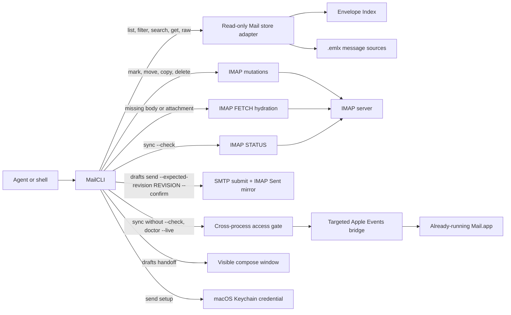

# MailCLI

Local Apple Mail access for the shell and coding agents.

[](go.mod)
[](#compatibility)
[](LICENSE)

MailCLI gives command-line tools and agents a typed interface to the accounts already configured in Apple Mail. It reads mail from Mail's local store, performs mailbox mutations over IMAP, and sends reviewed drafts over SMTP with credentials stored in the macOS Keychain via `mailcli send setup`; it never asks for passwords or tokens in chat.

```bash
mailcli messages search --sender example.com --after 2026-01-01 --json
mailcli messages get --ref MESSAGE_REF --json
mailcli attachments save --ref MESSAGE_REF --attachment ATTACHMENT_ID --output /absolute/path/file.pdf --json
```

## Why MailCLI

Apple Mail's scripting interface is slow for large reads and unsafe for composition on Mail 16. MailCLI splits those workloads and fails closed where Mail cannot preserve reviewed content.

- **Fast local reads.** Lists, filters, searches, message reads, raw source, and downloaded attachments come from Mail's local store without Apple Events. Body search scans the selected `.emlx` sources on demand within explicit message and byte limits; MailCLI builds no second index.
- **Direct mailbox changes.** Mark, move, copy, and delete run over IMAP without launching Mail.app and return typed server evidence. A lost COPY response fails closed with `imap_copy_outcome_unknown` until the destination is observed, so a retry never duplicates a message.
- **Reviewed sending.** New drafts, replies, and forwards are local review files. `drafts send` delivers the exact reviewed revision over SMTP and mirrors it into Sent over IMAP; an accepted submission is never sent twice, and `drafts reconcile` finishes an unresolved Sent copy from the retained bytes.
- **Honest freshness.** IMAP changes apply on the server immediately and reach the local read store after Mail.app's next sync; `sync --check` compares server and local counts, and every search page reports its coverage.
- **Agent contract.** One versioned JSON envelope with typed errors, opaque references, explicit pagination, a single recommended `next` action, and a machine-readable command and error catalog.

Direct reads and mutations add no work to the Mail.app process. The bounded integrations with Mail.app are fallback listing when the store cannot open, `sync` without `--check`, `doctor --live`, and optional visible compose handoff. The [manual](docs/documentation.md) holds every contract.

## Capabilities

| Area | Commands | Behavior |
|---|---|---|
| Accounts | `accounts list` | Accounts, sender identities, coverage evidence, and direct-transport support |
| Mailboxes | `mailboxes list`, `mailboxes resolve` | Standard roles, custom folders, and nested labels |
| Messages | `messages list`, `filter`, `search`, `get`, `raw`, `state`, `thread` | Metadata pages, typed filters, bounded body search, normalized or RFC 5322 content, IMAP flags, and conversations |
| Attachments | `attachments list`, `attachments save` | Inspects and exports received files without overwriting a destination |
| Responses | `messages reply`, `messages forward` | Local reply, reply-all, and forward review drafts |
| Composition | `drafts create`, `list`, `inspect`, `preview`, `edit`, `update`, `handoff`, `handoff-reconcile`, `open`, `adopt`, `discard`, `prune`, `reconcile` | Plain, Markdown, or safe HTML drafts, claim reconciliation, and visible compose handoff; scripted native save is unavailable |
| Sending | `send setup`, `drafts send` | Stores an app-specific password in the Keychain once, then delivers reviewed drafts over SMTP/IMAP with `--expected-revision REVISION --confirm` |
| Synchronization | `sync` | `--check` compares server and local counts over IMAP; without `--check` asks Mail.app to synchronize |
| Maintenance | `update` | Verifies a pinned Ed25519 signature and checksum, then replaces binary and skill with rollback |

Agents request contracts with `mailcli capabilities --for COMMAND_ID --json`, a comma-separated list for a workflow, or `--for 'messages.*'` for a family. The envelope is schema version 1; the nested `data.capabilities.schema_version` is 2 and is authoritative for effects, confirmation, typed `{kind,target,condition}` dependencies, result states, and limits. Scoped output links full parameter schemas through `schema_ref.resolve`; `--schemas` inlines them and `--outputs` adds output schemas and the error catalog with meaning and recovery guidance per code. Cache the contract per `contract_sha256`; `mailcli version --json` reports the same digest for a cheap cache check. Help text is for humans and is never parsed as capability data. See [for agents](docs/documentation.md#for-agents).

## Architecture


```mermaid
flowchart LR
    Agent["Agent or shell"] --> CLI["MailCLI"]
    CLI -->|"list, filter, search, get, raw"| Store["Read-only Mail store adapter"]
    Store --> Index["Envelope Index"]
    Store --> EMLX[".emlx message sources"]
    CLI -->|"mark, move, copy, delete"| IMAPMut["IMAP mutations"]
    CLI -->|"missing body or attachment"| IMAPHydrate["IMAP FETCH hydration"]
    CLI -->|"sync --check"| IMAPStatus["IMAP STATUS"]
    IMAPMut --> Server["IMAP server"]
    IMAPHydrate --> Server
    IMAPStatus --> Server
    CLI -->|"drafts send --expected-revision REVISION --confirm"| Transport["SMTP submit + IMAP Sent mirror"]
    CLI -->|"sync without --check, doctor --live"| Gate["Cross-process access gate"]
    Gate --> Bridge["Targeted Apple Events bridge"]
    Bridge --> Mail["Already-running Mail.app"]
    CLI -->|"drafts handoff"| Compose["Visible compose window"]
    CLI -->|"send setup"| Keychain["macOS Keychain credential"]
```

- **Read path.** The store adapter opens Mail's Envelope Index strictly read-only, validates the store generation, version, and schema first, and fails closed on anything it does not support. Message and attachment files are opened through one pinned store directory without following symlinks. A message that is not fully downloaded is completed with one bounded IMAP FETCH instead of Mail scripting.
- **Write path.** Mutations and sending use direct IMAP and SMTP with an app-specific password from the Keychain. Mutations for one account are serialized across processes, carry a stable operation identity, and report exactly which effects were proven.
- **Mail.app path.** The few Apple Events operations go through one cross-process gate, bind to the exact running Mail process, and never launch, quit, or restart Mail. An interrupted operation latches recovery until that Mail process is replaced.
- **No background state.** MailCLI runs no daemon, watcher, copied corpus, or index of its own; it keeps only review drafts, send evidence, bounded recovery bytes for unresolved sends, and a local cache of short IMAP excerpts.

See the [architecture chapter](docs/documentation.md#architecture) for package boundaries, the IMAP operation contract, and timeouts.

## Compatibility

| Requirement | Supported value |
|---|---|
| Operating system | macOS 15.6.1 |
| Architecture | Apple silicon, `darwin/arm64` |
| Mail | Mail 16.0, build `3826.700.81` |
| Envelope Index | Store version `4`, minor version `74003` |
| Go toolchain | Exact Go version declared in `go.mod` for source builds |

SMTP and IMAP are platform-independent, but MailCLI is deliberately a macOS product: it relies on the Keychain for credentials, Apple's Envelope Index and `.emlx` files for reads, and AppKit or Apple Events for the optional native integrations. Downloaded mail stays readable while Mail.app is closed; new mail appears once Mail.app has updated its store. An unsupported store version or schema fails closed instead of guessing, so a new macOS or Mail release may need an adapter update. See [platform and compatibility](docs/documentation.md#platform-and-compatibility) and [Limitations](#limitations).

## Install

The `v1.5.0` release archive installs the CLI and its agent skill. The script needs a trusted OpenSSL 3 with Ed25519 (for example Homebrew `openssl@3` as `OPENSSL_BIN`; macOS `/usr/bin/openssl` is LibreSSL and cannot verify). It authenticates the signed `SHA256SUMS` before downloading the archive and checks its digest before extraction.

```bash
set -euo pipefail
VERSION=1.5.0
if [[ ! "${VERSION}" =~ ^[0-9]+\.[0-9]+\.[0-9]+$ ]]; then
  printf 'Release version must use MAJOR.MINOR.PATCH: %s\n' "${VERSION}" >&2
  exit 1
fi
OPENSSL_BIN="${OPENSSL_BIN:-}"
if [[ -z "${OPENSSL_BIN}" ]] && command -v brew >/dev/null 2>&1; then
  BREW_OPENSSL_PREFIX="$(brew --prefix openssl@3 2>/dev/null || true)"
  if [[ -n "${BREW_OPENSSL_PREFIX}" ]]; then
    OPENSSL_BIN="${BREW_OPENSSL_PREFIX}/bin/openssl"
  fi
fi
if [[ -z "${OPENSSL_BIN}" || ! -x "${OPENSSL_BIN}" ]]; then
  printf 'A trusted OpenSSL 3 binary is required; set OPENSSL_BIN before continuing\n' >&2
  exit 1
fi
OPENSSL_VERSION="$("${OPENSSL_BIN}" version 2>/dev/null || true)"
if [[ "${OPENSSL_VERSION}" != OpenSSL\ 3.* ]]; then
  printf 'OPENSSL_BIN must provide OpenSSL 3 with Ed25519 support: %s\n' "${OPENSSL_BIN}" >&2
  exit 1
fi
BASE64_BIN="/usr/bin/base64"
if [[ ! -x "${BASE64_BIN}" ]]; then
  printf 'Required macOS base64 utility is missing: %s\n' "${BASE64_BIN}" >&2
  exit 1
fi
ARCHIVE_NAME="mailcli_${VERSION}_darwin_arm64.tar.gz"
ARCHIVE_ROOT="mailcli_${VERSION}_darwin_arm64"
RELEASE_BASE="https://github.com/Christopher-Schulze/MailCLI/releases/download/v${VERSION}"
WORK_DIR="$(mktemp -d "${TMPDIR:-/tmp}/mailcli-bootstrap.XXXXXX")"
trap 'rm -rf -- "${WORK_DIR}"' EXIT
curl --fail --location --proto '=https' --tlsv1.2 -o "${WORK_DIR}/SHA256SUMS" "${RELEASE_BASE}/SHA256SUMS"
curl --fail --location --proto '=https' --tlsv1.2 -o "${WORK_DIR}/SHA256SUMS.sig" "${RELEASE_BASE}/SHA256SUMS.sig"
RELEASE_PUBLIC_KEY_DER_B64='MCowBQYDK2VwAyEAVjVSufeZlmmMshZYeMB9u1xKoMvRavstpFqByv8Vzqg='
printf '%s' "${RELEASE_PUBLIC_KEY_DER_B64}" | "${BASE64_BIN}" -D -o "${WORK_DIR}/release-public-key.der"
"${OPENSSL_BIN}" pkey -pubin -inform DER -in "${WORK_DIR}/release-public-key.der" -out "${WORK_DIR}/release-public-key.pem" >/dev/null
"${BASE64_BIN}" -D -i "${WORK_DIR}/SHA256SUMS.sig" -o "${WORK_DIR}/SHA256SUMS.sig.raw"
if [[ "$(wc -c <"${WORK_DIR}/SHA256SUMS.sig.raw" | tr -d '[:space:]')" != 64 ]]; then
  printf 'Release signature must decode to exactly 64 bytes\n' >&2
  exit 1
fi
"${OPENSSL_BIN}" pkeyutl -verify -pubin -inkey "${WORK_DIR}/release-public-key.pem" -sigfile "${WORK_DIR}/SHA256SUMS.sig.raw" -in "${WORK_DIR}/SHA256SUMS" >/dev/null
curl --fail --location --proto '=https' --tlsv1.2 -o "${WORK_DIR}/${ARCHIVE_NAME}" "${RELEASE_BASE}/${ARCHIVE_NAME}"
ARCHIVE_DIGEST="$(awk -v archive="${ARCHIVE_NAME}" '{ file_name = $2; sub(/^\*/, "", file_name); if (NF == 2 && file_name == archive) { count++; digest = $1 } } END { if (count != 1 || digest !~ /^[[:xdigit:]]{64}$/) exit 1; print digest }' "${WORK_DIR}/SHA256SUMS")" || {
  printf 'SHA256SUMS must contain exactly one valid entry for %s\n' "${ARCHIVE_NAME}" >&2
  exit 1
}
printf '%s  %s\n' "${ARCHIVE_DIGEST}" "${ARCHIVE_NAME}" >"${WORK_DIR}/archive.SHA256SUMS"
(cd "${WORK_DIR}" && shasum -a 256 -c archive.SHA256SUMS)
if ! tar -tvzf "${WORK_DIR}/${ARCHIVE_NAME}" | awk -v root="${ARCHIVE_ROOT}" 'BEGIN { valid = 1; count = 0 } { name = $NF; sub(/\/$/, "", name); if ($1 !~ /^[-d]/ || (name != root && index(name, root "/") != 1) || name ~ /(^|\/)\.\.?($|\/)/ || name ~ /^\//) valid = 0; count++ } END { exit !(valid && count > 0) }'; then
  printf 'Verified archive contains an unsafe path or unsupported entry type\n' >&2
  exit 1
fi
tar -xzf "${WORK_DIR}/${ARCHIVE_NAME}" -C "${WORK_DIR}"
if [[ ! -x "${WORK_DIR}/${ARCHIVE_ROOT}/install.sh" ]]; then
  printf 'Verified archive has no executable installer: %s\n' "${ARCHIVE_ROOT}/install.sh" >&2
  exit 1
fi
"${WORK_DIR}/${ARCHIVE_ROOT}/install.sh"
command -v mailcli
mailcli version --json
```

Any failed check stops the script before `tar` or `install.sh`. Never replace the pinned key, OpenSSL path, release host, or archive name with values from the download. The installer puts the binary at `~/.local/bin/mailcli` and the skill at `~/.agents/skills/mailcli`, staged, verified, and committed with rollback. Start a new agent session afterwards so the skill is discovered.

Later updates of both components run through `mailcli update` (`--json` for one envelope). The updater verifies the signed `SHA256SUMS` against the pinned key before it downloads the archive, accepts only exact GitHub release hosts over HTTPS, checks the binary's architecture, signature, and version, and installs through the same rollback-safe transaction; concurrent installers are serialized. When updating from an older binary that expects plain version output, use `MAILCLI_OUTPUT=human mailcli update`.

To build from source, install the exact Go version declared in `go.mod` and the Xcode Command Line Tools:

```bash
git clone https://github.com/Christopher-Schulze/MailCLI.git
cd MailCLI
./scripts/build/install-local.sh
```

The source installer uses the same rollback-safe transaction; a first argument or `MAILCLI_SKILL_DESTINATION` selects other destinations. Run `./scripts/utils/create-local-signing-identity.sh` once so every source build carries the same local signature and macOS keeps your Keychain approval across rebuilds. The release binary is ad-hoc signed, not notarized; if Gatekeeper blocks the verified binary, remove only its quarantine attribute with `xattr -d com.apple.quarantine ~/.local/bin/mailcli`.

### Grant permissions

MailCLI uses the permissions of the terminal or agent host that launches it (**System Settings > Privacy & Security**). Accessibility and Screen Recording are not required.

| Permission | Required for |
|---|---|
| Full Disk Access | Accounts, mailboxes, messages, searches, raw source, and downloaded attachments |
| Automation access to Mail | `doctor --live`, `sync` without `--check`, and fallback listing when the store cannot open |
| No Automation permission | Mutations (`mark`, `move`, `copy`, `delete`) and `sync --check` use IMAP, but still read the local store for account and message identity |
| No Mail-store or Automation permission | `send setup`, `drafts send`, and transport-claim reconciliation use Keychain credentials and SMTP/IMAP; macOS may ask once for Keychain access |

```bash
mailcli doctor --json        # read path, no Apple Events
mailcli doctor --live --json # running Mail.app, one read-only probe
```

The live probe never launches Mail and never creates, saves, or sends a message; run it only before an operation that needs Apple Events. When a permission is missing, `doctor` names the exact System Settings remediation.

## Usage

Pipes and files receive JSON, terminals receive text; `--json`/`--human` or `MAILCLI_OUTPUT=json|human` override that. `mailcli help` lists all commands and `mailcli <command> --help` shows their options.

### Discover accounts and mailboxes

Never guess account, mailbox, message, or attachment identifiers; resolve them through the CLI.

```bash
mailcli accounts list --json
mailcli mailboxes list --account ACCOUNT_REF --json
mailcli mailboxes resolve --account ACCOUNT_REF --path Gesendet --json
mailcli mailboxes resolve --account ACCOUNT_REF --path Projects --path 2026 --json
```

`accounts list` reports each account's sender identities from a bounded Sent-history scan with explicit coverage evidence, and `direct_ops_supported` tells upfront whether sending and IMAP mutations can reach the provider. Mailbox paths are account-relative and exact, so localized folders such as `Gesendet` resolve without guessing, and Gmail labels stay distinct from folders.

### List, filter, and search

```bash
mailcli messages list --json
mailcli messages list --mailbox inbox --account ACCOUNT_REF --limit 50 --json
mailcli messages filter --read false --json
mailcli messages filter --mailbox MAILBOX_REF --read false --attachment true --json
mailcli messages search --sender example.com --after 2026-01-01 --json
mailcli messages search --query "invoice tracking number" --json
mailcli messages search --query "invoice tracking number" --exact-count --max-messages 50000 --json
mailcli messages list --fields sender,subject,date_received --json
```

`messages list` without `--mailbox` pages the unified inbox across active accounts, newest first. `--mailbox` accepts a ref, a role (`inbox`, `sent`, `drafts`, `trash`, `junk`, `archive`), or an exact path; an ambiguous selection returns candidate refs instead of guessing. All list commands default to 20 items and accept `--limit` values from 1 through 200; follow `data.page.next_cursor` until it is absent. `--fields` returns only the named summary fields to save tokens.

Body search scans local `.emlx` sources on demand within message and byte limits and keeps attachment names searchable. Every search page reports `data.page.coverage`: scanned messages and bytes, partial or missing sources, and whether the candidate count is exact. `data.page.coverage.complete` false means the search is not proven complete. If Mail's index changes between pages, the cursor fails with `search_cursor_stale` instead of silently skipping mail.

### Check replies to sent mail

```bash
mailcli messages search --after 2026-09-01 --with-threading --with-excerpt --json
mailcli messages search --after 2026-09-01 --with-threading --with-excerpt --cursor NEXT_CURSOR --json
mailcli messages get --ref MESSAGE_REF --fields summary,excerpt --json
```

`--with-threading` adds `in_reply_to`, `references`, and the parsed sender from the bounded header block; `--with-excerpt` adds a short text preview that skips quoted lines and signatures. Match the sent Message-ID against both `in_reply_to` and `references`; the sender domain is only a candidate. Empty or false values mean unknown, never proven absence. These reads never change mail.

### Read messages and attachments

```bash
mailcli messages get --ref MESSAGE_REF --json
mailcli messages get --ref MESSAGE_REF --view plain --json
mailcli messages get --ref MESSAGE_REF --view full --export /absolute/new/path/message.txt --json
mailcli messages raw --ref MESSAGE_REF --export /absolute/new/path/message.eml --json
mailcli messages thread --ref MESSAGE_REF --json
mailcli attachments list --ref MESSAGE_REF --json
mailcli attachments save --ref MESSAGE_REF --attachment ATTACHMENT_ID --output /absolute/new/file.pdf --json
```

`messages get` defaults to metadata with identity and completeness evidence; `--view plain` adds the normalized body and `--view full` adds headers. `--max-bytes` defaults to 1 MiB (up to 64 MiB); larger JSON fails with `output_too_large` and the exact required size instead of truncating. `--export` writes complete content to a new mode-0600 file and returns its size and SHA-256 instead of embedding it. A message that is not fully downloaded is completed with one targeted IMAP FETCH; if that fails, the local content is returned with `content_complete:false` and a hydration diagnostic. Attachment saves write the decoded part to a new absolute path and never overwrite a file. `messages thread` pages a conversation around the given message in both directions.

### Create and review a draft

Local structured drafts are the review boundary; creating or editing one never sends mail.

```bash
printf '%s' '{
  "from": "me@example.com",
  "to": [{"name": "Recipient", "address": "recipient@example.com"}],
  "cc": [],
  "bcc": [],
  "subject": "Project update",
  "body": "Hello,\n\nHere is the update.\n\nBest regards\n",
  "attachments": ["/absolute/path/report.pdf"]
}' | mailcli drafts create --input - --json

mailcli drafts create --to "Ann <ann@example.com>" --subject "Update" \
  --body-file /absolute/path/message.md --format markdown --attach /absolute/path/report.pdf --json
mailcli drafts inspect --ref DRAFT_REF --view full --json
mailcli drafts preview --ref DRAFT_REF --preview-format plain
mailcli drafts update --ref DRAFT_REF --expected-revision REVIEWED_REVISION --body-file /absolute/path/v2.md --json
mailcli drafts list --json
```

Every draft carries an opaque `revision` that covers recipients, subject, body, and each attachment's size and SHA-256. Review the full draft, keep `data.draft.revision`, and pass it to `drafts update` and `drafts send`; any change to the sendable content invalidates it and returns `draft_revision_conflict` instead of sending something unreviewed. Markdown is rendered with Goldmark; HTML keeps a strict allowlist of semantic elements and absolute links, removes scripts, styles, and remote resources, and reports what it removed as value-free `content_diagnostics`. Drafts hold at most 200 recipients, 100 attachments, and 512 MiB of attachment bytes.

### Send a reviewed draft

```bash
mailcli send setup --from me@example.com
mailcli drafts send --ref DRAFT_REF --expected-revision REVIEWED_REVISION --confirm --json
mailcli drafts reconcile --ref DRAFT_REF --json
```

`send setup` prompts once for an app-specific password without echo and stores it in the Keychain; aliases and non-Gmail/iCloud domains use `--account ACCOUNT_REF` with explicit, validated SMTP and IMAP hosts. Sending bypasses Mail.app: MailCLI composes the message, retains the exact bytes in a private recovery spool, submits over SMTP with STARTTLS, and appends a copy to Sent over IMAP.

| Outcome | Meaning |
|---|---|
| `sent` | The SMTP server accepted the message and the exact copy is in Sent; recipient delivery is not claimed. |
| `sent_mirror_pending` | SMTP accepted, the Sent copy is unresolved; `drafts reconcile` finishes it from the retained bytes and never resends. |
| `outcome_unknown` | The run stopped before a provable boundary; the retained claim blocks any resend until reconciliation checks Sent. |
| `smtp_rejected` | The server rejected the message with its full reply; nothing was sent. |

### Hand a draft to Mail.app

```bash
mailcli drafts handoff --ref DRAFT_REF --json
mailcli drafts handoff-reconcile --ref DRAFT_REF --attempt ATTEMPT_ID --outcome opened --confirm --json
```

`drafts handoff` opens the reviewed new draft in a visible Mail.app compose window through the macOS sharing service and never sends. If the outcome after dispatch is uncertain, inspect Mail.app and record what you saw with `drafts handoff-reconcile`.

### Reply, forward, and organize

```bash
printf '%s' '{"body":"Thanks, I will review this.\n"}' | mailcli messages reply --ref MESSAGE_REF --input - --all --json
printf '%s' '{"to":[{"address":"recipient@example.com"}],"body":"For your review.\n"}' | mailcli messages forward --ref MESSAGE_REF --input - --json
mailcli messages mark --ref MESSAGE_REF --read true --flagged false --json
mailcli messages move --ref MESSAGE_REF --mailbox DESTINATION_MAILBOX_REF --json
mailcli messages copy --ref MESSAGE_REF --mailbox DESTINATION_MAILBOX_REF --json
mailcli messages delete --ref MESSAGE_REF --confirm --json
mailcli sync --check --require-complete --account ACCOUNT_REF --json
```

Replies and forwards become local review drafts with correct recipients and `In-Reply-To`/`References` threading. Mark, move, copy, and delete run over IMAP and return `server_truth` evidence of the flags or phases that were actually proven. Marking, moving, or deleting a draft message needs `--allow-draft`, and deletion always needs `--confirm`. IMAP changes reach the local store after Mail.app's next sync; `sync --check` compares server and local counts per mailbox and exits 3 with `--require-complete` when coverage is incomplete.

### Batch

```bash
printf '%s' '{"operation":"read","items":[{"id":"a","ref":"MESSAGE_REF"},{"id":"b","ref":"OTHER_MESSAGE_REF","view":"plain"}]}' \
  | mailcli batch --input - --json
```

`batch` runs up to 100 read, attachment-save, mark, move, copy, or delete items in one invocation with ordered per-item results. Duplicate targets are rejected before anything runs, delete batches need `--confirm`, and failed items are marked `retryable` only when replay is proven safe.

## Limitations

- macOS on Apple silicon only; a new macOS or Mail release may need an adapter update.
- Direct sending and IMAP mutations support Gmail and iCloud by default; other providers need an account binding with explicit SMTP and IMAP hosts. Authentication uses app-specific passwords; OAuth is not implemented.
- Scripted Mail compose stays disabled because Mail 16 loses reviewed content; visible handoff supports new drafts with To recipients only and needs Mail.app as the default email application.
- New mail appears after Mail.app updates its local store; there is no remote-only inbox search.
- Body search is bounded work over local sources, not an instant index; narrow account, mailbox, sender, date, or subject for large stores.
- A successful SMTP submission proves acceptance, not recipient delivery or conversation grouping.

## JSON contract

Every data-bearing command returns the same envelope:

```json
{"schema_version": 1, "ok": true, "command": "accounts.list", "data": {"accounts": [], "complete": true}, "error": null}
```

A failure keeps any retained evidence in `data` and adds typed guidance plus one recommended next step:

```json
{
  "schema_version": 1, "ok": false, "command": "messages.get",
  "data": {"projection": {"view": "metadata", "fields": []}},
  "error": {
    "code": "mail_store_unavailable",
    "message": "cannot read ~/Library/Mail; grant Full Disk Access to the agent host",
    "guidance": {"phase": "read", "effect_certainty": "none", "retryability": "user_input_required",
                 "replay_allowed": false, "recovery": {"action": "correct"}}
  },
  "next": {"do": "ask_user", "why": "Ask the user to grant Full Disk Access to the calling app, or open Mail.app once, then retry."}
}
```

`next.do` is one of `retry`, `fix_input`, `check_state`, `ask_user`, or `stop`; a completed, partial, or unknown effect always means `check_state`, never a blind replay. Exit `0` means success, `1` a runtime or operation failure, `2` an invalid invocation or input, and `3` only an incomplete `sync --check --require-complete`. References and cursors are opaque and bound to the current Mail store; resolve a fresh reference after moving, copying, deleting, or synchronizing a message. The [output contract](docs/documentation.md#output-contract) and [errors and recovery](docs/documentation.md#errors-and-recovery) have the full rules.

## Agent skill

The companion skill [`skills/mailcli/SKILL.md`](skills/mailcli/SKILL.md) maps user intent to scoped capabilities and seven guides under `references/`; agents load only the guide for the current action. It fixes six standard workflows (triage, thread, search, reply, send, reply matching) and one rule for errors: follow `next.do`. Both installers place it at `~/.agents/skills/mailcli`.

| Local host | Personal skill location | Setup |
|---|---|---|
| [Codex](https://learn.chatgpt.com/docs/build-skills) | `~/.agents/skills/mailcli` | Default installation |
| [Claude Code](https://code.claude.com/docs/en/skills) | `~/.claude/skills/mailcli` | Link to the default installation once |

Create the Claude Code link only when that entry does not exist yet:

```bash
test -f "$HOME/.agents/skills/mailcli/SKILL.md" &&
  mkdir -p "$HOME/.claude/skills" &&
  test ! -e "$HOME/.claude/skills/mailcli" &&
  test ! -L "$HOME/.claude/skills/mailcli" &&
  ln -s "$HOME/.agents/skills/mailcli" "$HOME/.claude/skills/mailcli"
```

The link follows `mailcli update` automatically. `scripts/tests/report-skill-drift.sh --repository PATH --installed PATH` compares an installation read-only; for a Claude Code link, compare the canonical target directory.

## Safety model

| Guarantee | Mechanism |
|---|---|
| No credentials in chat, argv, or logs | App-specific passwords live only in the Keychain (`mailcli-smtp` service), entered once at a no-echo prompt |
| No writes to Mail's database | The Envelope Index is opened read-only; unsupported store layouts fail closed |
| No owned mail index | Searches scan current local sources on demand and persist no corpus |
| No unreviewed sending | A send needs the reviewed `revision` and `--confirm`; any content change invalidates the review |
| No duplicate send or copy | Claims and operation identities block replay until the real outcome is observed |
| No Mail.app lifecycle control | MailCLI binds to the exact running Mail process and never launches, quits, or restarts it |
| No phantom compose objects | Scripted compose is disabled; visible handoff opens a window and never sends |
| No overwrite or path substitution | Exports and attachment saves need a new absolute path; store files reject symlinks and replaced identities |
| No silent truncation or incompleteness | Oversized output fails with exact sizes, and every search page and message read reports completeness |

Local state (review drafts, claims, receipts, recovery spools, locks) lives under `~/Library/Application Support/MailCLI` with modes `0700`/`0600`; each accepted-message recovery spool is bounded to 1 GiB and removed after durable send evidence.

## Development

```bash
./scripts/build/build.sh
./scripts/tests/test.sh
./scripts/tests/test.sh --full
./scripts/tests/test-release.sh
./scripts/tests/run-race-tests.sh
./scripts/benchmarks/run-performance-evidence.sh
MAILCLI_LIVE_TESTS=1 ./scripts/tests/test.sh --full-checks
```

`test.sh` checks only the staged change: formatting, lint, the changed packages with their reverse dependencies, and the affected documentation and shell checks. `--full` runs the complete non-live suite with coverage, lint, `govulncheck`, and the isolated release, install, and skill gates; it never touches your Mail store, Keychain, or installed skill. Live Mail, Keychain, and responsiveness checks are opt-in through environment flags, and the race detector runs only manually. `test-release.sh` builds, signs, packages, installs, and rolls back a release in a temporary directory without publishing anything. The benchmark runner uses generated fixtures and loopback servers only. See [development](docs/documentation.md#development).

## License

MailCLI is available under the [MIT License](LICENSE). Copyright 2026 Christopher Schulze.
