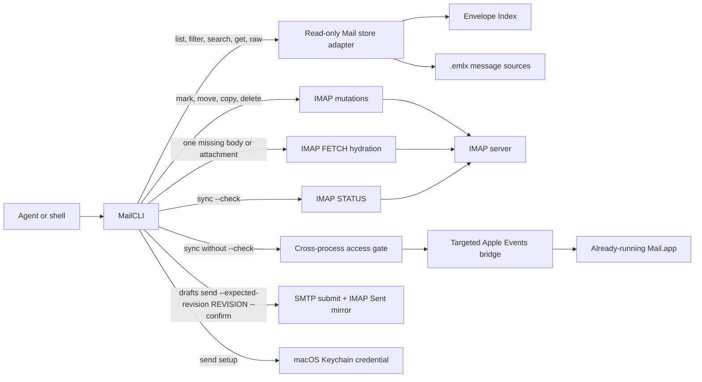

# MailCLI

Local Apple Mail access for the shell and coding agents.

[](go.mod)
[](#compatibility)
[](LICENSE)

MailCLI gives command-line tools and agents a typed interface to the accounts already configured in Apple Mail. It reads mail from Mail's local store, performs mailbox mutations over IMAP, and sends reviewed drafts autonomously over SMTP. MailCLI uses SMTP and IMAP under the hood with credentials stored in the macOS Keychain via `mailcli send setup`; it never asks for account passwords, OAuth tokens, or other credentials in chat.

```bash
mailcli messages search --sender example.com --after 2026-01-01 --json
mailcli messages get --ref MESSAGE_REF --json
mailcli attachments save --ref MESSAGE_REF --attachment ATTACHMENT_ID --output /absolute/path/file.pdf --json
```

## Why MailCLI

Apple Mail's scripting interface can perform targeted mailbox mutations but performs poorly for large reads and is unsafe for composition on the verified Mail 16 host. MailCLI separates those workloads and fails closed where Mail cannot preserve reviewed content.

- Lists, filters, metadata searches, message reads, raw source, and downloaded attachments use Mail's local store without Apple Events. Incomplete-content hydration uses bounded IMAP FETCH.
- Body search scans the selected `.emlx` sources on demand within explicit message and byte limits. It decodes text parts and keeps attachment names searchable without decoding attachment payloads. MailCLI creates no second mail index.
- Mark, move, copy, and delete execute directly over IMAP using provisioned account credentials without launching Mail.app. Every mutation returns typed server-truth evidence. COPY arms a stable operation identity before dispatch, preserves COPYUID and destination UID evidence when available, and fails closed with `imap_copy_outcome_unknown` after a lost response until an exact destination observation proves what happened; retries never blindly duplicate a copy. MOVE fallback evidence lists proven phases such as `copy`, `source_flag`, `uid_expunge`, or `cleanup_deferred`.
- Local-store staleness is documented and honest: IMAP mutations apply immediately on the server; the local read store updates on Mail.app's next background sync. `mailcli sync --check` inspects server vs local message counts over IMAP without launching Mail.app.
- Local new, reply, reply-all, and forward drafts remain fully reviewable. `drafts send --expected-revision REVISION --confirm` delivers autonomously over SMTP and mirrors the message into Sent over IMAP with no Mail.app involvement; it rejects a historical native save claim before provider or credential resolution, composition, SMTP, or Sent APPEND, preserving the claim for reconcile-only recovery. When SMTP accepts but Sent mirroring is unresolved, reconciliation reuses the exact retained MIME bytes even if the original attachment paths have changed or disappeared. Unreliable scripted save remains blocked before contacting Mail. A new draft can also be handed to Apple's visible Compose Email sharing service without sending.
- Machine output uses one versioned JSON envelope with typed errors, opaque references, explicit pagination, and search coverage.

Direct reads and mutations add no work to the Mail.app process: local reads stay on the Envelope Index and `.emlx` sources, while sending, marking, moving, copying, and deleting operate autonomously over standard SMTP and IMAP transports. Incomplete message detail uses targeted IMAP hydration. The bounded integrations with Mail.app are store-unavailable account listing and explicit-mailbox listing, `sync` without `--check`, `doctor --live`, and optional visible compose handoff. Mail.app remains the local sync engine feeding the SQLite read store.

## Capabilities

Before automation, request the needed contract with `mailcli capabilities --for COMMAND_ID --json`; use `--for 'FAMILY.*'` when choosing within a family and the full `mailcli capabilities --json` catalog only for cross-family discovery. Retain inspected contracts for the same binary identity. The outer JSON envelope remains schema version 1; its nested `data.capabilities.schema_version` is 2 and is authoritative for command IDs, read/write class, confirmation, store requirements, typed `{kind,target,condition}` dependencies, result states, and hard limits. Follow each dependency only when its published condition applies. Help text is for humans and must not be parsed as capability data.

Detail JSON responses support bounded projections. Use `--view metadata|plain|full` for named views or `--fields field1,field2` for an explicit selection; the supported fields, defaults, and byte limits are published under `data.capabilities.limits.output_projection`. `messages get` and `drafts inspect` default to metadata, while draft creation and update responses default to the canonical plain body. `--max-bytes` defaults to 1 MiB and rejects oversized JSON with `output_too_large` instead of truncating it. `messages get`, `messages raw`, and `drafts inspect` accept `--export /absolute/new/path`; the complete body or raw source is written to a mode-0600 exclusive file and JSON returns verified `data.content_export` size and SHA-256 metadata without embedding the exported bytes.

`batch --json` applies its byte limit to the complete response; `--max-bytes` defaults to 1 MiB and accepts up to 64 MiB. Each read item accepts `view` (`metadata`, `plain`, or `full`) or a `fields` array. Omitting both `view` and `fields` uses metadata unless request-level read defaults select another projection. The companion skill uses `metadata` in its batch-read examples.

| Area | Commands | Behavior |
|---|---|---|
| Accounts | `accounts list` | Lists configured accounts and bounded sender identities with explicit coverage evidence plus `direct_ops_supported`/`direct_ops_reason` endpoint annotation |
| Mailboxes | `mailboxes list`, `mailboxes resolve` | Handles Inbox, Sent, Drafts, Archive, Junk, Trash, custom folders, and nested labels |
| Messages | `messages list`, `filter`, `search`, `get`, `raw`, `state`, `thread` | Pages metadata, applies typed filters, scans bodies, returns normalized or RFC 5322 content, reads server flags over IMAP, and lists conversation members from the local index |
| Attachments | `attachments list`, `attachments save` | Inspects and exports received files without overwriting a destination |
| Responses | `messages reply`, `messages forward` | Creates local reply, reply-all, and forward review drafts without opening a compose object |
| Composition | `drafts create`, `list`, `inspect`, `preview`, `edit`, `update`, `handoff`, `handoff-reconcile`, `open`, `adopt`, `discard`, `prune`, `reconcile` | Manages plain, Markdown, or safe HTML drafts, prunes stale never-sent drafts, reconciles retained send, historical native save, and handoff claims, opens a reviewed new draft visibly, and adopts a Mail.app store draft as an editable local copy; scripted native save is unavailable |
| Sending | `send setup`, `drafts send` | Stores an app-specific password in the Keychain once, then delivers reviewed drafts over SMTP/IMAP with `--expected-revision REVISION --confirm`; no Mail.app required. Short protocol phases use a 30 s budget; encoded SMTP DATA and IMAP APPEND transfers scale with message size at a 1 MiB/s floor, up to a 15 min cap |
| Synchronization | `sync` | `--check` reports server-vs-local deltas over IMAP; `--require-complete` makes incomplete checks exit 3; without `--check` asks Mail.app to synchronize |
| Maintenance | `update` | Checks GitHub, verifies a pinned Ed25519 signature plus checksum, and replaces the binary and companion skill in separate verified steps with rollback evidence |

Run `mailcli help` for the compact command overview. Focused command help accepts
`help`, `-h`, or `--help` and renders aligned long options with semantic value
names and readable defaults. The global `--json` flag may appear before, between, or after the command path; a value position such as `--query --json` remains a value.

Capability discovery, local draft management, sending, credential setup, and direct reconciliation of
transport claims bypass the Mail store and Mail.app entirely. Reply and forward creation read the source message's header block from the Mail
store and write only local draft files. Legacy baseline reconciliation remains store-backed.
Missing or unknown command/subcommand routes do the same.
They therefore avoid SQLite, `plutil`, and Apple Events startup work.

## Architecture


```mermaid
flowchart LR
    Agent["Agent or shell"] --> CLI["MailCLI"]
    CLI -->|"list, filter, search, get, raw"| Store["Read-only Mail store adapter"]
    Store --> Index["Envelope Index"]
    Store --> EMLX[".emlx message sources"]
    CLI -->|"mark, move, copy, delete"| IMAPMut["IMAP mutations"]
    CLI -->|"one missing body or attachment"| IMAPHydrate["IMAP FETCH hydration"]
    CLI -->|"sync --check"| IMAPStatus["IMAP STATUS"]
    IMAPMut --> Server["IMAP server"]
    IMAPHydrate --> Server
    IMAPStatus --> Server
    CLI -->|"sync without --check"| Gate["Cross-process access gate"]
    Gate --> Bridge["Targeted Apple Events bridge"]
    Bridge --> Mail["Already-running Mail.app"]
    CLI -->|"drafts send --expected-revision REVISION --confirm"| Transport["SMTP submit + IMAP Sent mirror"]
    CLI -->|"send setup"| Keychain["macOS Keychain credential"]
```

Mail.app remains the source of truth for reads; mailbox mutations execute over IMAP and sent messages are mirrored into the account's Sent mailbox over IMAP. MailCLI has no daemon, background process, watcher, copied corpus, owned search index, or persistent mailbox cache of its own; it retains only bounded exact MIME bytes for unresolved accepted sends.

Direct IMAP work uses a bounded pool per host, port, and username. The CLI default is two authenticated TLS connections per account. Library callers may configure one through eight with `imapclient.NewWithOptions`; this setting has no public CLI flag and is not changed by capability discovery. LIST, STATUS, SEARCH, and FETCH may overlap on separate sessions; APPEND, STORE, COPY, MOVE, and DELETE are exclusive against reads and each other for the same account so selected-mailbox and UIDVALIDITY state cannot race. Different accounts have independent pools. Context cancellation applies while waiting for either the operation gate or a pool slot, credentials never enter pool identity, and `Close` blocks new acquisition, waits for acquired operations, then attempts LOGOUT and closes every pooled session. Separate Client values do not coordinate, so callers that split one account across Clients own cross-client mutation ordering. `imapclient.OperationContracts` and `mailcli capabilities --json` expose the same operation class, gate, session ownership, mailbox-selection, and UIDVALIDITY contract.

The CLI requires a cross-process mutation lock by default. If configuration-directory, lock-client, or lock-file setup fails, mutations return `imap_mutation_lock_unavailable` before dispatch and read-only commands remain usable. `drafts send` preflights the account lock before SMTP submission. Setting `MAILCLI_IMAP_MUTATION_LOCK=off` explicitly allows process-local ordering and disables the cross-process lock.

Before opening SQLite, the store adapter inventories numeric Mail generation directories. It selects a sole supported `V10` generation, or a supported `V10` when `PersistenceInfo.plist` explicitly identifies it as active alongside a newer generation. A newer or ambiguous generation fails closed with `unsupported_mail_store_schema` or `ambiguous_mail_store_generation`; library callers can pin and validate an exact `Config.MailStorePath`. The adapter then opens Mail's Envelope Index with SQLite `mode=ro`, `query_only=1`, WAL participation, and a private connection cache. Before reading, it validates the store version, framework version, UUID, required schema, account catalog, mailbox mapping, and filesystem containment. Message, mailbox-cache, and external-attachment files are opened relative to one held Mail-store directory descriptor with macOS `O_NOFOLLOW_ANY`; selection, hashing, and copying remain bound to the same regular-file identity. Unsupported store version, minor version, UUID or required schema fails with `unsupported_mail_store_schema` before any message query runs. Framework-only drift retains read access with an explicit `store_profile_unverified` warning.

The write bridge acquires a context-aware BSD advisory lock, requires Mail to be running, verifies the exact `com.apple.mail` process identity, and binds each request to that PID. Before any potentially mutating Apple Event, it durably pre-arms an exact-PID recovery marker; if that write cannot be synchronized, the operation does not start. SIGINT, SIGTERM, and context cancellation also write a private bridge marker so the script can close an owned unsent compose object; only an unresponsive bridge is force-stopped after the cleanup grace period. Each invocation owns one `osascript` process group, reaps it, and verifies that the group is gone before releasing the gate. A definite completion clears the pre-armed state; an incomplete operation or caller crash leaves it latched as `mail_recovery_required` until the affected Mail process has been replaced. Read probes, search, raw reads, sync triggers, and Automation denial do not create false recovery state. MailCLI never launches, activates, quits, kills, or restarts Mail.

See [docs/documentation.md](docs/documentation.md) for the full command, reference, cursor, draft, send, and coverage contracts.

## Compatibility

MailCLI has a deliberately narrow support target:

| Requirement | Supported value |
|---|---|
| Operating system | macOS 15.6.1 |
| Architecture | Apple silicon, `darwin/arm64` |
| Mail | Mail 16.0, build `3826.700.81` |
| Envelope Index | Store version `4`, minor version `74003` |
| Go toolchain | Exact Go version declared in `go.mod` for source builds |

SMTP and IMAP are operating-system-independent protocols; the current MailCLI product is not a cross-platform mail client. It uses the macOS Keychain for transport credentials, Apple's Envelope Index and .emlx files for local reads and identity resolution, and AppKit/Apple Events for optional native integration. Linux and Windows have no supported credential/store backend or release build.

Already-downloaded messages remain readable while Mail.app is closed, provided the local store is accessible. New-message discovery through list/search waits for Mail.app to update that store. A complete local search is not proof of current server completeness. SMTP sends messages; IMAP reads and organizes server mail. MailCLI currently exposes targeted IMAP hydration, mutations and checks, not a general remote-only inbox/search interface. See [platform and freshness boundaries](docs/documentation.md#platform-and-freshness-boundaries) for the operation-by-operation contract.

MailCLI fails closed on unsupported store version, minor version, UUID or required schema. Framework-only drift keeps verified-layout reads available with the profile marked `unverified`. This protects the local database from speculative compatibility code, but it also means a new macOS or Mail release may require an explicit adapter update.

## Install

The `v1.4.0` release archive installs both the native CLI and its companion agent skill:

Before downloading release files, install and independently verify an OpenSSL 3 binary with Ed25519 support through a trusted package-management workflow. With Homebrew, for example, install `openssl@3` and set `OPENSSL_BIN` to `$(brew --prefix openssl@3)/bin/openssl`, then verify that binary before continuing. macOS `/usr/bin/openssl` is LibreSSL and does not provide the required verifier. The commands below authenticate the exact signed `SHA256SUMS` bytes before downloading the archive, then verify the exact `darwin/arm64` archive digest before extraction or installer execution.

```bash
set -euo pipefail
VERSION=1.4.0
if [[ ! "${VERSION}" =~ ^[0-9]+\.[0-9]+\.[0-9]+$ ]]; then
  printf 'Release version must use MAJOR.MINOR.PATCH: %s\n' "${VERSION}" >&2
  exit 1
fi
OPENSSL_BIN="${OPENSSL_BIN:-}"
if [[ -z "${OPENSSL_BIN}" ]] && command -v brew >/dev/null 2>&1; then
  BREW_OPENSSL_PREFIX="$(brew --prefix openssl@3 2>/dev/null || true)"
  if [[ -n "${BREW_OPENSSL_PREFIX}" ]]; then
    OPENSSL_BIN="${BREW_OPENSSL_PREFIX}/bin/openssl"
  fi
fi
if [[ -z "${OPENSSL_BIN}" || ! -x "${OPENSSL_BIN}" ]]; then
  printf 'A trusted OpenSSL 3 binary is required; set OPENSSL_BIN before continuing\n' >&2
  exit 1
fi
OPENSSL_VERSION="$("${OPENSSL_BIN}" version 2>/dev/null || true)"
if [[ "${OPENSSL_VERSION}" != OpenSSL\ 3.* ]]; then
  printf 'OPENSSL_BIN must provide OpenSSL 3 with Ed25519 support: %s\n' "${OPENSSL_BIN}" >&2
  exit 1
fi
BASE64_BIN="/usr/bin/base64"
if [[ ! -x "${BASE64_BIN}" ]]; then
  printf 'Required macOS base64 utility is missing: %s\n' "${BASE64_BIN}" >&2
  exit 1
fi
ARCHIVE_NAME="mailcli_${VERSION}_darwin_arm64.tar.gz"
ARCHIVE_ROOT="mailcli_${VERSION}_darwin_arm64"
RELEASE_BASE="https://github.com/Christopher-Schulze/MailCLI/releases/download/v${VERSION}"
WORK_DIR="$(mktemp -d "${TMPDIR:-/tmp}/mailcli-bootstrap.XXXXXX")"
trap 'rm -rf -- "${WORK_DIR}"' EXIT
curl --fail --location --proto '=https' --tlsv1.2 -o "${WORK_DIR}/SHA256SUMS" "${RELEASE_BASE}/SHA256SUMS"
curl --fail --location --proto '=https' --tlsv1.2 -o "${WORK_DIR}/SHA256SUMS.sig" "${RELEASE_BASE}/SHA256SUMS.sig"
RELEASE_PUBLIC_KEY_DER_B64='MCowBQYDK2VwAyEAVjVSufeZlmmMshZYeMB9u1xKoMvRavstpFqByv8Vzqg='
printf '%s' "${RELEASE_PUBLIC_KEY_DER_B64}" | "${BASE64_BIN}" -D -o "${WORK_DIR}/release-public-key.der"
"${OPENSSL_BIN}" pkey -pubin -inform DER -in "${WORK_DIR}/release-public-key.der" -out "${WORK_DIR}/release-public-key.pem" >/dev/null
"${BASE64_BIN}" -D -i "${WORK_DIR}/SHA256SUMS.sig" -o "${WORK_DIR}/SHA256SUMS.sig.raw"
if [[ "$(wc -c <"${WORK_DIR}/SHA256SUMS.sig.raw" | tr -d '[:space:]')" != 64 ]]; then
  printf 'Release signature must decode to exactly 64 bytes\n' >&2
  exit 1
fi
"${OPENSSL_BIN}" pkeyutl -verify -pubin -inkey "${WORK_DIR}/release-public-key.pem" -sigfile "${WORK_DIR}/SHA256SUMS.sig.raw" -in "${WORK_DIR}/SHA256SUMS" >/dev/null
curl --fail --location --proto '=https' --tlsv1.2 -o "${WORK_DIR}/${ARCHIVE_NAME}" "${RELEASE_BASE}/${ARCHIVE_NAME}"
ARCHIVE_DIGEST="$(awk -v archive="${ARCHIVE_NAME}" '{ file_name = $2; sub(/^\*/, "", file_name); if (NF == 2 && file_name == archive) { count++; digest = $1 } } END { if (count != 1 || digest !~ /^[[:xdigit:]]{64}$/) exit 1; print digest }' "${WORK_DIR}/SHA256SUMS")" || {
  printf 'SHA256SUMS must contain exactly one valid entry for %s\n' "${ARCHIVE_NAME}" >&2
  exit 1
}
printf '%s  %s\n' "${ARCHIVE_DIGEST}" "${ARCHIVE_NAME}" >"${WORK_DIR}/archive.SHA256SUMS"
(cd "${WORK_DIR}" && shasum -a 256 -c archive.SHA256SUMS)
if ! tar -tvzf "${WORK_DIR}/${ARCHIVE_NAME}" | awk -v root="${ARCHIVE_ROOT}" 'BEGIN { valid = 1; count = 0 } { name = $NF; sub(/\/$/, "", name); if ($1 !~ /^[-d]/ || (name != root && index(name, root "/") != 1) || name ~ /(^|\/)\.\.?($|\/)/ || name ~ /^\//) valid = 0; count++ } END { exit !(valid && count > 0) }'; then
  printf 'Verified archive contains an unsafe path or unsupported entry type\n' >&2
  exit 1
fi
tar -xzf "${WORK_DIR}/${ARCHIVE_NAME}" -C "${WORK_DIR}"
if [[ ! -x "${WORK_DIR}/${ARCHIVE_ROOT}/install.sh" ]]; then
  printf 'Verified archive has no executable installer: %s\n' "${ARCHIVE_ROOT}/install.sh" >&2
  exit 1
fi
"${WORK_DIR}/${ARCHIVE_ROOT}/install.sh"
command -v mailcli
mailcli version --json
```

`set -euo pipefail` and the explicit signature, signature-length, archive-name, and checksum checks stop the shell before `tar` or `install.sh` when any prerequisite or verification fails. Never replace the pinned key, OpenSSL path, release host, archive name, or signed-manifest bytes with values obtained from the downloaded archive.

The release installer copies the verified binary to `~/.local/bin/mailcli` and the skill to `~/.agents/skills/mailcli`. It stages and verifies both before any live rename, records a durable transaction manifest, commits each target with identity-checked rollback, and deterministically recovers interrupted installs before accepting a new one. It rejects unsafe parent or destination symlinks and unresolved backup paths, and never removes macOS security attributes. Start a new agent session after installation so the skill is discovered.

When upgrading through an older binary or installer that assumes plain version output, invoke `MAILCLI_OUTPUT=human mailcli update` or `MAILCLI_OUTPUT=human /absolute/path/install.sh`. Old binaries ignore this setting; new binaries use it for inherited version probes. Current installers and updaters select that format explicitly.

After the first installation, update both components with:

```bash
mailcli update
mailcli update --json
```

Interactive terminals show bounded progress while MailCLI checks GitHub, verifies the exact `SHA256SUMS` bytes against its pinned Ed25519 release key, downloads the named `darwin/arm64` asset, verifies its digest and Mach-O code signature, and runs the rollback-safe installer. JSON mode emits exactly one envelope and no animation. Concurrent updaters are serialized, and every metadata, asset, checksum, signature, and redirect URL is restricted to exact trusted GitHub hosts, HTTPS with the default port, and at most 10 redirects. Shell startup injection variables are removed from the installer environment. The installer owns a private process group; cancellation sends `SIGTERM` so its rollback trap runs, then force-cleans and verifies any resistant descendant before returning.

To build from source instead, install the exact Go version declared in `go.mod` and the Xcode Command Line Tools for CGO:

```bash
git clone https://github.com/Christopher-Schulze/MailCLI.git
cd MailCLI
./scripts/build/install-local.sh
```

The source installer builds a native `darwin/arm64` executable and uses the same rollback-safe transaction as the release installer to install the matching binary and companion skill together. It writes the binary to `~/.local/bin/mailcli` and the skill to `~/.agents/skills/mailcli` by default. Pass an explicit binary destination as the first argument to install elsewhere; set `MAILCLI_SKILL_DESTINATION` to choose the skill destination.

For repeated agent commands in a source checkout, `scripts/utils/mailcli-preflight.sh capabilities` caches the validated capabilities envelope by the executable's SHA-256 and schema version. `scripts/utils/mailcli-preflight.sh doctor` caches a healthy local-store check for five minutes under the same identity; use `--refresh` or `invalidate` after installation, a binary/schema change, or any relevant failure. Live `doctor --live` checks are never cached.

The published release binary is ad-hoc signed but not Apple-notarized because no Developer ID identity is available. A browser download can therefore be quarantined by Gatekeeper. Verify `SHA256SUMS` first; if macOS still blocks the verified binary, explicitly remove only that binary's quarantine attribute with `xattr -d com.apple.quarantine ~/.local/bin/mailcli`. The installer never performs this bypass automatically.

### Grant permissions

MailCLI uses the permissions of the process that launches it. Grant permissions to the terminal or agent host that runs MailCLI in **System Settings > Privacy & Security**.

| Permission | Required for |
|---|---|
| Full Disk Access | Accounts, mailboxes, messages, searches, raw source, and downloaded attachments |
| Automation access to Mail | Live diagnostics, `sync` without `--check`, and fallback listing when the store open fails |
| No Automation permission | Message mutations (`mark`, `move`, `copy`, `delete`) and `sync --check` use IMAP, but still require access to the local Mail store for account/message identity and local comparison |
| No Mail-store or Automation permission | Sending (`send setup`, `drafts send`) and direct transport-claim reconciliation use Keychain credentials and SMTP/IMAP; macOS may request Keychain access |

Accessibility and Screen Recording are not required.

Verify the read path without contacting Mail.app:

```bash
mailcli doctor --json
```

Use the live probe only before an operation that needs Apple Events:

```bash
mailcli doctor --live --json
```

Mail must already be running. The live probe never launches Mail or creates, saves, or sends a message. It verifies the exact process identity and performs one read-only Apple Events version query. Mail 16 retains some hidden outgoing backends even after `close saving no`, so a healthcheck must never manufacture a compose object.

## Usage

Output follows explicit `--json`/`--human`, then `MAILCLI_OUTPUT=json|human`, then stdout: pipes/files receive JSON and terminals receive human text. Conflicting modes or invalid environment values fail with exit 2 before initialization. Boolean `=false` selects the opposite mode. Help remains text; use capabilities for machine discovery.

### Discover accounts and mailboxes

Never guess account, mailbox, message, or attachment identifiers. Resolve them through the CLI.

```bash
mailcli accounts list --json
mailcli mailboxes list --account ACCOUNT_REF --json
mailcli mailboxes resolve --account ACCOUNT_REF --path Gesendet --json
mailcli mailboxes resolve --account ACCOUNT_REF --path Projects --path 2026 --json
```

### List, filter, and search

```bash
mailcli messages list --limit 25 --json
mailcli messages list --mailbox inbox --account ACCOUNT_REF --json
mailcli messages list --mailbox MAILBOX_REF --limit 25 --json
mailcli messages filter --mailbox MAILBOX_REF --read false --attachment true --json
mailcli messages search --sender example.com --after 2026-01-01 --json
mailcli messages search --query "invoice tracking number" --max-messages 50000 --json
mailcli messages search --query "invoice tracking number" --exact-count --max-messages 50000 --json
mailcli messages filter --subject invoice --exact-count --json
```

`messages list` without `--mailbox` pages the unified inbox across active accounts, newest first; each item includes `account` (an account ref) and its resolved `mailbox_ref`, retained under field projections. `--account REF` narrows the inbox or mailbox selection. `--mailbox` accepts a ref, a case-insensitive role (`inbox`, `sent`, `drafts`, `trash`, `junk`, `archive`), or an exact slash-separated path. Ambiguous selections return `ambiguous_mailbox` with candidate refs; select one ref or narrow by account. Unified inbox and role/path selection require the supported local store. Inbox cursors bind to the store, account scope and resolved inbox set; keep the same selection across pages. Inserts behind a traversed boundary require restarting.

All list commands default to 20 items, accept `--limit` values from 1 through 200, and bound JSON envelopes to 1 MiB by default (`--max-bytes` accepts up to 64 MiB). An oversized list page reports exact byte evidence and correction guidance without returning rows or a continuation cursor. Continue with `data.page.next_cursor` until it is absent; conversation traversal uses `data.thread.next_cursor` and `data.thread.prev_cursor`. Search pagination is bounded best-effort rather than a cross-process SQLite snapshot: every page reports `coverage.consistency:"best_effort"` and a compact `coverage.index_revision`, and cursor replay fails with `search_cursor_stale` if Mail's Envelope Index changed. A change during one page fails with `search_index_changed`; restart that page without its cursor. Metadata-only search fetches the requested page plus one continuation candidate and runs no candidate-count query by default. Its default `coverage.candidate_messages` is the observed row lower bound; `coverage.candidate_messages_exact` is true only when no continuation candidate remains. Body search starts with the smallest result window needed for the requested page and grows its two-worker scan window only while candidates do not match. A byte-blocked candidate after prior progress gets an inclusive cursor. If no candidate was classified and the next source cannot fit within the remaining scan budget, search returns `search_budget_too_small` with `error.required_bytes` and no new cursor; the required value is rounded up to a binary MiB and is also supplied in recovery arguments. Retry the same page with `--max-scan-bytes` at least that value, retaining the incoming `--cursor` if supplied; an initial page needs no cursor. The recovery arguments retain the original query, filters, projection, and cursor while changing the scan budget. Page size, `--max-scan-bytes`, and `--max-messages` may change between pages; search filters, `--exact-count`, store identity, and index revision remain bound to the cursor. Tokens created before this fingerprint change may require restarting the search. The default body-search candidate count is the number of candidates observed while producing the page, and becomes exact only when stream exhaustion proves that total. `--exact-count` requests a separate exact candidate total for metadata or body search after the current cursor. The bounded probe covers at most `max-messages + 1` candidates for body searches and the normalized default bound for metadata filters; if the total exceeds its bound, the command fails with `search_count_limit_exceeded` instead of scanning or presenting a truncated count as exact. `--max-messages` defaults to 50,000 and bounds body candidate scanning; metadata exact counts use that same normalized bound. Coverage also reports scanned messages and bytes, partial sources, missing sources, bounds, and `data.page.coverage.complete`.

### Check replies to sent mail

```bash
mailcli messages search --after 2026-09-01 --with-threading --with-excerpt --limit 25 --json
mailcli messages search --after 2026-09-01 --with-threading --with-excerpt --limit 25 --cursor NEXT_CURSOR --json
mailcli messages get --ref MESSAGE_REF --fields summary,excerpt --excerpt-length 240 --json
```

`messages list`, `messages filter` and `messages search` accept two opt-in, read-only enrichments. `--with-threading` fills `summary.in_reply_to` and `summary.references` (arrays of every valid msg-id in header order, with angle brackets), `summary.from` (`{name, address}`, decoded name, lowercased domain) and `summary.threading_complete`. It reads only the bounded RFC header block, locally or through an IMAP header fetch. `--with-excerpt` fills `summary.excerpt`, `summary.excerpt_complete` and `summary.excerpt_source` (`local`, `imap-partial` or `unavailable`). An excerpt prefers text/plain over text extracted from HTML, drops quoted `>` lines and a trailing signature after an exact `-- ` line, collapses whitespace and is cut at a rune boundary to `--excerpt-length` runes (default 240, range 1 to 1000). Each excerpt reads at most 256 KiB of RFC source; a larger or missing source reports `excerpt_complete:false`. Without a flag the keys are present with empty values. An empty list or false completeness means unknown, never proven absence.

To tie a reply to a sent message, compare the sent Message-ID with both `in_reply_to[]` and `references[]`. The sender domain in `from.address` is only a candidate signal. `messages get` accepts the same excerpt through `--fields excerpt` plus `excerpt_complete` and `excerpt_source`, and ordered unfolded headers through `--fields header_fields` (`[{name, value}]`). None of these reads change or store mail. The envelope `schema_version` stays 1 and the capability manifest stays schema 2; all fields are additive.

### Read messages and attachments

```bash
mailcli messages get --ref MESSAGE_REF --json
mailcli messages get --ref MESSAGE_REF --view plain --json
mailcli messages get --ref MESSAGE_REF --view full --export /absolute/new/path/message.txt --json
mailcli messages raw --ref MESSAGE_REF
mailcli messages raw --ref MESSAGE_REF --export /absolute/new/path/message.eml --json
mailcli messages thread --ref MESSAGE_REF --json
mailcli attachments list --ref MESSAGE_REF --json
mailcli attachments save \
  --ref MESSAGE_REF \
  --attachment ATTACHMENT_ID \
  --output /absolute/non-existing/path/document.pdf \
  --json
```

`messages get` defaults to metadata, including identity and content-completeness evidence but no headers or body. Request `--view plain` for normalized body text without headers or `--view full` for headers plus body. `--fields` accepts only the field names published in capability JSON and cannot be combined with `--view`; invalid selections fail before message retrieval. Targeted IMAP hydration is complete only after MailCLI parses the retrieved RFC 5322 source; failed JSON retains useful local evidence and the safe hydration diagnostic. In human mode, `messages raw` streams a complete local `.emlx` source directly to stdout instead of allocating a second 64 MiB string; JSON and targeted IMAP hydration remain bounded. `--export` writes complete normalized body or raw RFC 5322 bytes to a new mode-0600 file, verifies the final path identity, byte count, and SHA-256, and omits the exported content from JSON. Export requires complete normalized content and refuses relative, existing, symlinked, or non-directory destinations. Attachment IDs are deterministic MIME-part paths, including during targeted hydration, while exported attachment files contain the decoded MIME-part bytes and report their media type, byte count, and SHA-256. Attachment export requires an absolute path and refuses to overwrite an existing file. External attachment discovery is bounded per directory to 10,000 entries, 128 hashed ambiguity candidates, and 1 GiB cumulative hash input. A limit returns `attachment_resource_limit`; no partial scan reports an attachment as complete or downloaded. External files retain precedence over complete inline MIME data because they can change reported metadata and saved bytes.

`messages thread` lists a message's conversation members from Mail's local `conversation_id` grouping in chronological order, projected like `messages list`. Its initial page contains the seed, balanced around it where possible; `truncated` means more visible members remain in either direction. Pass `data.thread.prev_cursor` for older members or `data.thread.next_cursor` for newer members as `--cursor` with the same `--ref`. Cursors bind the Mail store, seed/conversation and ordering keyset; unrelated index writes do not invalidate them. Traversal is best effort, and inserts behind a traversed boundary may require restarting. Deleted rows and deactivated-account members are filtered before the page limit.

When local content is retained after failed hydration, JSON includes `content_complete:false`, `missing_parts`, and the hydration diagnostic; use the named recovery command before treating the content as complete. Message-ID-backed hydration and mutations verify every exact server candidate, and duplicate exact matches fail closed with `imap_ambiguous_message_id` before any UID becomes a target.

### Create and review a message

MailCLI uses local structured drafts as the review boundary. Creating or editing a local draft never sends mail.

Each draft read or update returns an opaque `revision`. Review a full create/update result or use `drafts inspect --ref DRAFT_REF --view full --json`, then retain `data.draft.revision`. A complete already-reviewed result does not require a duplicate inspect. Both `drafts update` and `drafts send` require that value in `--expected-revision`; send also requires `--confirm`. A changed recipient, body, attachment fingerprint, or other send field invalidates the review. Metadata-only views and list summaries are insufficient for content review.

If an external editor finishes after another writer changed the draft, `draft_revision_conflict` preserves the newer draft and the editor candidate. JSON includes `error.draft_revision_conflict` with the expected/current revisions and `candidate_path`. Inspect both versions, explicitly merge as needed, then save with `drafts update --ref DRAFT_REF --expected-revision REVIEWED_REVISION --input CANDIDATE_PATH --json`. Never blindly copy the current revision from an error into a retry. Claims and receipts retain the reviewed revision; old evidence without it remains inspect/reconcile-only and returns `draft_revision_unavailable` from send.

```bash
printf '%s' '{
  "from": "me@example.com",
  "to": [{"name": "Recipient", "address": "recipient@example.com"}],
  "cc": [],
  "bcc": [],
  "subject": "Project update",
  "body": "Hello,\n\nHere is the update.\n\nBest regards\n",
  "attachments": ["/absolute/path/report.pdf"]
}' | mailcli drafts create --input - --json

mailcli drafts inspect --ref DRAFT_REF --json
mailcli drafts inspect --ref DRAFT_REF --view plain --json
mailcli drafts preview --ref DRAFT_REF --preview-format plain
mailcli drafts list --limit 200 --fields age_days --json
mailcli drafts preview --ref DRAFT_REF --max-bytes 67108864 --json
```

`drafts list` defaults to 20 entries and accepts 1 through 200. Draft-list and preview JSON output is limited to 1 MiB by default; `--max-bytes` accepts up to 64 MiB. `drafts list --fields` can omit derived age and timestamps while retaining each ref, review fields, send/save/handoff state, and page revision/cursor. An oversized list page returns no summaries or cursor and supplies recovery that preserves the incoming cursor. A preview is returned whole or fails with `output_too_large` and a complete inspect/export command; MailCLI never truncates preview content.

The same draft can be created without JSON plumbing:

```bash
mailcli drafts create \
  --to "Recipient <recipient@example.com>" \
  --subject "Project update" \
  --body-file /absolute/path/message.md \
  --format markdown \
  --attach /absolute/path/report.pdf \
  --json

mailcli drafts edit --ref DRAFT_REF
mailcli drafts handoff --ref DRAFT_REF
mailcli drafts handoff-reconcile --ref DRAFT_REF --attempt ATTEMPT_ID --outcome opened --confirm --json
```

Markdown is rendered with Goldmark. HTML uses a strict allowlist of semantic typography, headings, links, lists, preformatted blocks, and table elements. Only absolute `http`, `https`, or `mailto` link targets and anchor titles survive; CSS, `style` attributes, event handlers, forms, media, scripts, SVG, MathML, templates, and remote resources are removed. Images are not embedded, while a supplied `alt` value remains in the plain alternative. Rich drafts expose deterministic value-free `content_diagnostics` entries for removed elements, attributes, URLs, styles, and resources. The plain alternative retains non-redundant absolute link targets as `(URL)`, preserves `<pre>` and `<code>` whitespace, emits indented list markers and pipe-delimited table rows, and ignores unsafe links and active subtrees. Incoming `text/html` message parts use the same semantic conversion. `drafts edit` is human-only (`audience:human`); nonterminal stdin returns `interactive_required` with `drafts update` recovery. Agents review with `drafts inspect`/`preview` and update authorized changes using the reviewed revision. On a terminal, `drafts edit` invokes the configured editor directly without a shell and in a private process group, validates the complete result, and atomically replaces the local draft only if its initial revision still matches under the draft lock. Cancellation terminates the editor and its owned descendants before returning, while the original draft remains unchanged.

`drafts handoff` uses Apple's documented `NSSharingServiceNameComposeEmail`, waits for its delegate to confirm the handoff, opens a visible compose window, retains the local draft, and never sends. It requires Mail.app to be the current default email application so a misconfigured `mailto:` handler cannot launch another app. Apple's API cannot guarantee From, CC, BCC, or reply/forward threading, so handoff rejects those semantics instead of silently dropping them. Select the sender and add CC/BCC in Mail.app when required. The command persists an attempt ID and attachment snapshots around the native dispatch boundary. Its public `data.draft_handoff.outcome` is `handed_off`, `not_handed_off`, or `unknown`; the stored lifecycle and reconciliation labels below remain more detailed. An untyped error after dispatch is also `unknown` and preserves the claim. Cancellation before dispatch returns error code `handoff_canceled_before_dispatch` with public outcome `not_handed_off` and cleans the staged evidence; cancellation, timeout, or an unparseable native result after dispatch returns `handoff_outcome_unknown`, suppresses late success, retains the snapshots, and blocks retry. Inspect Mail.app and then run `mailcli drafts handoff-reconcile --ref DRAFT_REF --attempt ATTEMPT_ID --outcome opened|failed --confirm --json` to remove the retained claim and snapshots. `confirmed_opened` means only that the sharing-service delegate reported success; `confirmed_failed` means it reported failure. AppKit exposes no supported cancellation or compose-window close operation, so MailCLI never claims that an external window was closed.

Draft creation requires an explicit `body` field; an intentionally empty string is valid. Draft updates are partial patches: omitted fields preserve their stored values, including body and attachments, while explicit empty strings or arrays clear the selected field. Changing the body format requires an explicit replacement body; repeating the current format preserves it. Duplicate addresses across To, CC, and BCC are rejected. Hard limits are 64 KiB of subject text, 4 MiB of reviewed body text, 200 total recipients, 100 attachments, and 512 MiB of attachment bytes. MailCLI records attachment size and SHA-256 when it creates or updates a local draft.

The unsupported `drafts save` command is absent; invoking it returns the normal drafts unknown-command error before Mail contact. Scripted native composition remains disabled on the verified Mail 16 build. Historical controlled live tests proved that Mail can accept scripted setters while persisting only the automatic signature, lose recipients, reject scripted attachments, and retain an invisible outgoing backend after `close saving no`. That evidence applies to unsupported native composition, not autonomous delivery: `mailcli capabilities --json` keeps scripted `compose_write:false` and `compose_attachment_write:false`, advertises `send_transport:"smtp"` with `raw_mime_send:true`, and separately advertises visible handoff support. Retained reconciliation fails closed unless Mail supplied an exact final native body and exact headers, recipient roles, and attachment count.

Historical draft-save recovery uses `mailcli drafts reconcile --ref <DRAFT_REF> --json`. A valid historical `save_attempt` is observed under the draft lease without starting a new save. Exact observation returns `data.saved_draft` and permits verified cleanup; an unknown result retains the claim and draft with reconciliation guidance. Invalid or conflicting claims fail closed. An idle draft has no save attempt to reconcile.

### Send a reviewed draft

Sending bypasses Mail.app entirely: MailCLI resolves the SMTP and IMAP endpoints from the draft's From address, loads the app-specific password from the macOS Keychain, submits the composed RFC 5322 message over SMTP with STARTTLS, and appends it to the account's Sent mailbox over IMAP. Short protocol phases use 30 seconds; encoded DATA and APPEND transfers use a size-aware budget at a 1 MiB/s floor, capped at 15 minutes, and the caller context takes precedence.
If SMTP accepts the message but local finalization of the composed reader returns a close error, MailCLI retains the acceptance evidence and cleanup diagnostic, keeps the send claim non-replayable, and never submits the message again.

Before that transport lifecycle starts, `drafts send` rejects any historical `save_attempt` with `draft_save_retry_blocked`. It performs no provider or credential lookup, composition, send-claim creation, SMTP submission, or Sent APPEND, and keeps the original draft and save claim byte-identical for `drafts reconcile` recovery or explicit discard.

```bash
mailcli send setup --from me@example.com
mailcli drafts inspect --ref DRAFT_REF --view full --json
mailcli drafts send --ref DRAFT_REF --expected-revision REVIEWED_REVISION --confirm --json
```

For an alias that needs an explicit account binding, run `mailcli send setup --account ACCOUNT_REF --from ALIAS [--credential-account LOGIN]`. The binding selects the Keychain credential for SMTP and IMAP, supports accounts with no Sent history, and fails closed with typed ambiguity or stale-account errors when identity cannot be proven.

`send setup` prompts for the app-specific password once per account with no echo and stores it in the Keychain; MailCLI never displays, logs, or returns it, and `--remove` deletes the stored credential. A confirmed send reports compatibility outcome `sent` with canonical `submission_accepted:true` (the SMTP server returned its final 2yz response after DATA) and `sent_copy_observed:true` (the exact message was persisted in Sent); neither field confirms recipient delivery. Before SMTP submission, MailCLI atomically retains the composed MIME in a private mode-0600 recovery spool and records its size and SHA-256 in the send claim. If SMTP accepted the message but the Sent mirror failed, the outcome is `sent_mirror_pending` with `submission_accepted:true` and `sent_copy_observed:false`: recipient delivery is unverified, MailCLI never resends the submission, and `drafts reconcile` searches and verifies Sent before retrying a known failed APPEND from that exact spool. The spool is retired only after durable terminal send evidence permits cleanup. After DATA, a complete SMTP 4xx/5xx final reply is definitive `smtp_rejected` with its full enhanced-status reply in `error.message`; 4xx is transient and 5xx permanent, so retry only through a later explicit send after the corresponding condition is resolved. A missing, truncated, malformed, timed-out, or unreadable final reply is `smtp_submission_unknown`; retain the claim and never replay blindly. Missing credentials fail with `smtp_credentials_missing` and remediation naming `mailcli send setup`. `drafts send` and `drafts reconcile` use bounded operation deadlines that scale with the draft's attachment bytes and are capped at 15 minutes; caller cancellation still wins.
If a send ends after SMTP acceptance before local claim recording, `drafts reconcile` verifies exactly one matching Sent message over IMAP and local claim state; duplicates or identity mismatches fail closed, and the message is never resubmitted. Missing or changed recovery-spool bytes block a mirror retry and retain the draft for explicit resolution.

Transport code lookup traverses wrapped and joined causes. When an error tree includes an outcome-uncertain transport code, that code remains public even if cleanup or rejection failures are joined, while the full error text keeps both diagnostics.

### Reply, forward, and organize

```bash
printf '%s' '{"body":"Thanks, I will review this.\n"}' \
  | mailcli messages reply --ref MESSAGE_REF --input - --all --json

printf '%s' '{"to":[{"address":"recipient@example.com"}],"body":"For your review.\n"}' \
  | mailcli messages forward --ref MESSAGE_REF --input - --json

mailcli messages mark --ref MESSAGE_REF --read true --flagged false --json
mailcli messages move --ref MESSAGE_REF --mailbox DESTINATION_MAILBOX_REF --json
mailcli messages copy --ref MESSAGE_REF --mailbox DESTINATION_MAILBOX_REF --json
mailcli messages delete --ref MESSAGE_REF --confirm --json
mailcli sync --check --require-complete --account ACCOUNT_REF --json
mailcli sync --account ACCOUNT_REF --json
```

Reply and forward commands require a store-bound source reference and create local review drafts. They do not open, save, or send a Mail compose object. Forward inputs still require an explicit destination.

Mark, move, and delete reject messages identified as drafts. To intentionally mutate a draft, first close every editor for it and repeat with `--allow-draft`; deletion still also requires `--confirm`. This prevents an open Mail editor from re-saving the draft while IMAP moves or deletes it.

## JSON contract

Every data-bearing command supports `--json` and returns the same top-level envelope:

```json
{
  "schema_version": 1,
  "ok": true,
  "command": "accounts.list",
  "data": {
    "accounts": []
  },
  "error": null
}
```

Exit code `0` normally means success, `1` means a runtime, configuration, Mail, or operation failure, and `2` means an invalid invocation or caller-supplied input rejected during validation, including malformed references and cursors. Missing `--confirm`, operational failures whose recovery guidance asks for correction, and partial or uncertain effects remain exit `1`. A partial JSON batch returns `ok:false` with `error.code:"batch_partial"` and exit `1`; always inspect the envelope and every batch item. Exit code `3` is reserved for `sync --check --require-complete` when the check ran but `data.sync_check.complete` is false. That exit-3 JSON remains a successful result with `ok:true`, `error:null`, and every typed failure under `data.sync_check.failures`; the same incomplete check without `--require-complete` keeps the compatible exit code 0. Errors use stable machine-readable codes and actionable messages. Failed envelopes include `error.guidance` with finite `phase`, `effect_certainty`, `retryability`, `replay_allowed`, and `recovery` fields. `retryability` is `safe`, `observe_required`, `user_input_required`, or `terminal`; `observe_required` and false `replay_allowed` prohibit replay until the supplied evidence is checked. `recovery.action` is `retry`, `observe`, `reconcile`, `correct`, `inspect`, or `none`; command and `args` appear only when they match a supported capability schema, while `operation_id` identifies durable mutation or send evidence. References and cursors are opaque and bound to the current Mail store. Resolve a fresh reference after moving, copying, deleting, or synchronizing a message.

JSON startup, execution, and teardown are finalized before stdout is written. A configuration failure before service creation returns one `ok:false` envelope with `error.code:"initialization_failed"` (or a preserved typed initialization code) and exit code `1`. A transport or store close failure adds `data.finalization.state:"failed"` and `error.code:"finalization_failed"`; when the command itself succeeded, that error is also promoted to the top level and the exit code becomes `1`. Existing command failures and confirmed operation evidence remain intact. stdout write failures return exit code `1` without fabricating a successful envelope; invalid command output becomes `serialization_failed`.

`mailcli capabilities --json` publishes a schema for every command. Each `commands[].schema` describes flags, value types, defaults, bounds, enum values, required inputs, positional arguments, JSON input fields, and incompatible combinations. Use `mailcli capabilities --for messages.search --json` for one exact command, `--for ID,ID,...` for a workflow, or `--for 'messages.*'` for a family. Scoped output publishes `schema_ref.resolve` argv for complete canonical parameter schemas; execute it with the retained binary before using uninspected parameters, or add `--schemas` to inline them. `--schemas` requires `--for`. Add `--outputs` (with or without `--for`) to include each command's `schema.output` tree and the shared `$defs` they reference; for example `mailcli capabilities --for messages.search --outputs --json | jq '.data.capabilities.commands[0].schema.output'`. Output trees are opt-in so ordinary discovery stays small. Commands remain in canonical order with complete effect, confirmation, audience, dependency and result-state metadata. Each command declares `limit_refs`; scoped output includes exactly the referenced limit keys and retains shared policies. `--limits` returns the full limit set without command contracts and cannot be combined with `--for`. Empty, unknown, repeated or overlapping selections return `invalid_argument`. The removed selectors also return normal invalid input. Only a single-command selection returns `data.capabilities.scope`.

## Agent skill

Skill-drift tests always build a fresh binary in their own temporary root, independently of prior tests or ambient build-output overrides. Source-install tests use a private source copy and verify that failure cleanup preserves the checkout binary. The opt-in responsiveness gate builds into its temporary `MAILCLI_BUILD_OUTPUT` and passes that path through `MAILCLI_BINARY`.

The repository includes a companion skill at [`skills/mailcli/SKILL.md`](skills/mailcli/SKILL.md). Its compact entrypoint maps user intent to scoped capabilities and seven portable guides under `references/`. Agents load only the guide for the current action, request only needed detail fields, and assess only that command's dependencies. The common entrypoint retains pagination, content completeness, reviewed draft revisions, transport evidence, and replay rules. Both installation paths include every guide; tests follow all skill links from isolated installations and reject missing, escaping, or unreachable documents. The repository product manual remains separate from the packaged operational guides.

The release installer and `scripts/build/install-local.sh` stage and verify the matching binary and skill together. Their default skill destination is `~/.agents/skills/mailcli`; discovery depends on the agent host:

| Local host | Documented personal skill location | MailCLI setup |
| --- | --- | --- |
| [Codex](https://learn.chatgpt.com/docs/build-skills) | `~/.agents/skills/mailcli` | Default installation |
| [Claude Code](https://code.claude.com/docs/en/skills) | `~/.claude/skills/mailcli` | Link this entry to the default installation; Claude Code supports symlinked skill folders |

After a verified default installation, expose it to local Claude Code without creating a second copy. Run these commands only when `~/.claude/skills/mailcli` is absent; inspect any existing entry instead of replacing it:

```bash
test -f "$HOME/.agents/skills/mailcli/SKILL.md" &&
  mkdir -p "$HOME/.claude/skills" &&
  test ! -e "$HOME/.claude/skills/mailcli" &&
  test ! -L "$HOME/.claude/skills/mailcli" &&
  ln -s "$HOME/.agents/skills/mailcli" "$HOME/.claude/skills/mailcli"
```

Direct source/release installers also accept an absolute `MAILCLI_SKILL_DESTINATION`, for example `MAILCLI_SKILL_DESTINATION="$HOME/.claude/skills/mailcli" ./scripts/build/install-local.sh`. Self-update deliberately ignores this override and updates only the canonical skill destination, so refresh a separate copy through its original installer with the same override. The linked default installation follows canonical updates automatically. These are documented local discovery paths, not a claim that every agent host or cloud session loads the same directory. Start a new agent session if discovery does not refresh.

Use `scripts/tests/report-skill-drift.sh` for a separate read-only comparison of a user installation: pass `--repository PATH --installed PATH` for explicit inputs, and it reports `match`, `missing`, `mismatch`, or `unstable` plus a reconciliation command without installing anything. For a Claude Code link, compare the canonical target directory. The implementation gate validates repository/package identity only in temporary installation roots.

## Safety model

| Guarantee | Mechanism |
|---|---|
| No provider credentials in chat, argv, or logs | Complete local reads use no provider credentials; direct SMTP/IMAP operations use the app-specific password provisioned through `send setup` in the macOS Keychain, never displayed or logged |
| No Mail database writes | Opens the Envelope Index read-only and rejects journal or schema mutations |
| No owned mail index | Searches current local sources on demand and persists no corpus |
| No broad Apple Events reads | Uses the store for enumeration and search, with bounded IMAP FETCH for one resolved incomplete message only |
| No corrupted or phantom scripted compose data | Blocks scripted draft export; sending composes locally and delivers over SMTP, and visible handoff uses Apple's sharing service, retains the reviewed local draft, and never sends |
| No Mail.app lifecycle control | Requires the exact running Mail PID and never launches, activates, quits, kills, or restarts Mail.app |
| No residual bridge process | Waits for the owned `osascript` leader, terminates residual group members, and verifies process-group absence before command completion |
| No residual installer or editor process | Gracefully cancels each private process group, force-cleans resistant descendants after a bounded grace period, and verifies group absence |
| No Apple Events backlog after uncertainty | Durably pre-arms the exact affected Mail PID before compose or sync and rejects every later live operation after an incomplete caller until that process has been replaced |
| No accidental overwrite or path substitution | Attachment export accepts only an absolute destination that does not exist; Mail-store sources reject symlinks and file-identity replacement |
| No silent incomplete search | Reports source completeness and scan bounds on every search page |

MailCLI stores only local review drafts, historical send/save claims, accepted-message recovery spools, and access/update lock state under `~/Library/Application Support/MailCLI`. SMTP credentials live in the macOS Keychain under the `mailcli-smtp` service, never in files. State directories use mode `0700`; state files and recovery spools use mode `0600`. Each accepted-message recovery spool is bounded to 1 GiB and is removed after durable terminal send evidence; unresolved or corrupt evidence remains available for explicit recovery.

## Limitations

- Mail 16 scripted save remains disabled. Direct SMTP/IMAP sending supports Gmail (`gmail.com`, `googlemail.com`) and iCloud (`icloud.com`, `me.com`, `mac.com`) by default. Other domains require a stable account binding with validated explicit SMTP and IMAP endpoints; without one, they fail with `transport_unsupported_provider` before credentials are stored or network connections begin. Visible handoff supports new drafts only and requires Mail.app as the default email application.
- Apple's Compose Email sharing service has no reliable From, CC, BCC, reply-thread, or forward-thread controls; MailCLI rejects those handoff inputs rather than changing their meaning.
- Local reply and forward drafts use store-bound source identity and support direct SMTP delivery with the reviewed recipients, body, attachments and RFC threading headers. Native compose handoff does not support reply/forward semantics; server/client conversation grouping is not guaranteed by a successful SMTP submission.
- `drafts open` reads a store message/draft ref through the same retrieval and hydration path as `messages get`; Mail 16 has no reliable headless in-place editor for it. Local `draft_*` refs use `drafts inspect`/`preview`. The read path uses the local store or targeted IMAP hydration and does not require Mail Automation.
- Messages that are not fully downloaded may need one targeted IMAP FETCH. The result reports remaining missing parts instead of claiming completeness.
- Body search is bounded work over current `.emlx` sources, not an instant persistent index. Narrow account, mailbox, sender, date, or subject scope for large stores.

## Development

```bash
./scripts/tests/test.sh
./scripts/tests/test.sh --full
./scripts/tests/test.sh --push-check
./scripts/tests/test-release.sh
./scripts/tests/report-release-state.sh
go test ./internal/mailstore -run '^$' -bench '^BenchmarkAttachmentCatalogShortcut$' -benchtime=1x
./scripts/build/build.sh
./scripts/release/build-release.sh "${VERSION:?set to the release version}"
MAILCLI_LIVE_TESTS=1 ./scripts/tests/test.sh --full-checks
MAILCLI_KEYCHAIN_LIVE=1 ./scripts/tests/test.sh --full-checks
MAILCLI_LIVE_RESPONSIVENESS=1 ./scripts/tests/test.sh --full-checks
```

Explicit `--full-checks` runs opt-in live stages at the end when their environment flags are set and prints an explicit skip line for each unset flag. `MAILCLI_LIVE_TESTS=1` adds the live Mail-store tests, `MAILCLI_KEYCHAIN_LIVE=1` adds the live Keychain round trip, and `MAILCLI_LIVE_RESPONSIVENESS=1` builds a fresh temporary binary and passes it through `MAILCLI_BINARY` and runs the Mail responsiveness gate against one already-running Mail process. The default run prompts nothing live; the same flags work when invoking the underlying commands directly.

The default `test.sh` run is fast: it materializes the exact staged tree, checks changed Go/shell formatting and syntax, runs configured lint plus changed packages and their transitive normal/test reverse dependencies, and selects applicable documentation and registered shell checks. It runs no race or vulnerability scan. Review performs applicable staged lint first; gate reuses a matching source/tool/configuration receipt. `--full` runs the integrated non-live suite once after the task queue and records a clean HEAD/tree/toolchain/configuration proof; `--push-check` validates that proof without publishing. Full proof is missing or incomplete after a skipped required scan and stale after source/environment changes. The full suite checks every shell script's syntax and executable bit, then runs `gofmt`, module verification, one configured `golangci-lint` pass (errcheck, govet, ineffassign, staticcheck and unused), blocking `govulncheck`, uncached race tests, coverage, forbidden-path architecture checks, and isolated release, source-installation, and skill-validation tests. Repository/package identity is checked only through temporary package and installation roots; the gate never reads or writes the user's `~/.agents/skills/mailcli`. Run `./scripts/tests/report-skill-drift.sh` separately when the real user installation needs an explicit read-only comparison. It defaults to `GOMAXPROCS=4` and two concurrent Go packages so verification cannot consume every logical CPU or fan out unbounded package builds; `MAILCLI_TEST_CPUS` and `MAILCLI_TEST_PACKAGES` provide explicit positive-integer overrides. Keychain tests stay off the login keychain; compose Handoff tests stay off AppKit. A documentation contract test pins every shared operational bound — page limits, search caps, byte budgets, timeouts, and pool sizes — to the same normalized value across this file, `docs/documentation.md`, the skill guides, and the implementing scripts or exported constants, so a changed number in any single file fails the suite. MIME regression tests lock Parts, To/CC roles, BCC parsing and wire exclusion, multipart alternatives, attachment structure, and threading. `scripts/tests/test-commit-authority.sh` proves a failed child test preserves its exact exit status, cannot reach a later commit step, and rejects `git add` or `git commit` in normal scripts and workflows. `scripts/tests/test-release.sh` is the repeatable macOS `darwin/arm64` release gate: it checks the exact Go pin, required tools, module integrity, `go build ./...`, the native stripped build, generated-key signatures, checksums, archive contents, installation, and SIGKILL rollback recovery. It uses a temporary release directory and test home; it does not publish or overwrite `dist/` assets. `scripts/tests/test-release-authority.sh` rejects tag creation or deletion, pushes, release mutation or upload commands, direct GitHub API access, and release-publishing workflow actions anywhere in normal scripts or workflows. The main gate snapshots all local branch, remote-tracking, and tag refs around release verification and fails on any change. The release builder refuses to overwrite assets and writes the archive, `SHA256SUMS`, and `SHA256SUMS.sig` to `dist/` unless `MAILCLI_RELEASE_DIRECTORY` selects an empty absolute directory. Release binaries use `-trimpath -ldflags='-s -w -extldflags=-dead_strip'`. The release test rejects DWARF sections and binaries above the enforced 12 MiB + 128 KiB size budget. `scripts/tests/report-release-state.sh` is a separate read-only comparison of source version, HEAD, tag, `dist/`, checksums, checkout binary, installed binary, and installed skill; add `--remote-required` to compare the origin tag and GitHub release assets, and `--strict` to turn drift or unavailable evidence into a failing status. A missing or older artifact is reported, never silently treated as current proof. Use `./scripts/tests/report-release-state.sh --strict --remote-required` only when the release artifacts, installed targets, and remote release are intentionally expected to match the current HEAD. Live tests are opt-in through environment flags with `--full-checks` (each unset flag prints an explicit skip line). `MAILCLI_LIVE_RESPONSIVENESS=1` builds the binary and runs the responsiveness gate; it executes three bounded read-only live probes, requires the exact same Mail process identity and compose-object count, rejects residual `mailcli` or `osascript` processes and Mail-held repository handles, and verifies that the post-operation probe remains within the measured and absolute latency bounds. On the supported release host, bypassing store startup reduced process-inclusive `drafts list --json` peak RSS from 10.13-10.45 MB to 6.59-6.78 MB; this is a host-specific reference measurement, not a platform guarantee.

Bootstrap authenticity is covered by `scripts/tests/test-bootstrap.sh`, which signs a local fixture with Ed25519 and proves tampered manifests, signatures, keys, archive bytes, names, and duplicate entries cannot reach extraction or installer execution.

Release builds retain normal compiler inlining, with stripping, path trimming and native dead-code removal. The release gate enforces the 12 MiB + 128 KiB executable limit.

## License

MailCLI is available under the [MIT License](LICENSE). Copyright 2026 Christopher Schulze.
