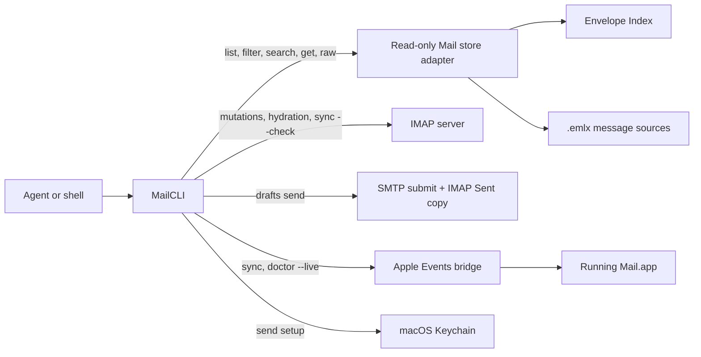

# MailCLI

Local Apple Mail access for the shell and coding agents.

[](go.mod)
[](#compatibility)
[](LICENSE)

MailCLI gives command-line tools and agents a typed interface to the accounts already configured in Apple Mail. It reads mail from Mail's local store, performs mailbox mutations over IMAP, and sends reviewed drafts over SMTP with credentials stored in the macOS Keychain via `mailcli send setup`; it never asks for passwords or tokens in chat.

```bash
mailcli messages search --sender example.com --after 2026-01-01 --json
mailcli messages get --ref MESSAGE_REF --json
mailcli attachments save --ref MESSAGE_REF --attachment ATTACHMENT_ID --output /absolute/path/file.pdf --json
```

## Why MailCLI

Apple Mail's scripting interface is slow for large reads and unsafe for composition on Mail 16. MailCLI splits those workloads and fails closed where Mail cannot preserve reviewed content.

- Reads, searches, raw source, and attachments come from Mail's local store without Apple Events; body search scans `.emlx` sources on demand, with no second index.
- Mark, move, copy, and delete run over IMAP and return typed server evidence; a lost COPY response fails closed instead of duplicating.
- Reviewed drafts, replies, and forwards go out over SMTP with a Sent copy over IMAP; an accepted send is never submitted twice.
- One versioned JSON envelope with typed errors, opaque references, pagination, and search coverage.

Direct reads and mutations add no work to the Mail.app process. The bounded integrations with Mail.app are fallback listing, `sync` without `--check`, `doctor --live`, and optional visible compose handoff. The [manual](docs/documentation.md) holds every contract.

## Capabilities

| Area | Commands | Behavior |
|---|---|---|
| Accounts | `accounts list` | Accounts, sender identities, coverage evidence, and direct-transport support |
| Mailboxes | `mailboxes list`, `mailboxes resolve` | Standard roles, custom folders, and nested labels |
| Messages | `messages list`, `filter`, `search`, `get`, `raw`, `state`, `thread` | Metadata pages, typed filters, bounded body search, normalized or RFC 5322 content, IMAP flags, and conversations |
| Attachments | `attachments list`, `attachments save` | Inspects and exports received files without overwriting a destination |
| Responses | `messages reply`, `messages forward` | Local reply, reply-all, and forward review drafts |
| Composition | `drafts create`, `list`, `inspect`, `preview`, `edit`, `update`, `handoff`, `handoff-reconcile`, `open`, `adopt`, `discard`, `prune`, `reconcile` | Plain, Markdown, or safe HTML drafts, claim reconciliation, and visible compose handoff; scripted native save is unavailable |
| Sending | `send setup`, `drafts send` | Stores an app-specific password in the Keychain once, then delivers reviewed drafts over SMTP/IMAP with `--expected-revision REVISION --confirm` |
| Synchronization | `sync` | `--check` compares server and local counts over IMAP; without `--check` asks Mail.app to synchronize |
| Maintenance | `update` | Verifies a pinned Ed25519 signature and checksum, then replaces binary and skill with rollback |

Agents request contracts with `mailcli capabilities --for COMMAND_ID --json`. The envelope is schema version 1; the nested `data.capabilities.schema_version` is 2 and is authoritative for effects, confirmation, dependencies, result states, and limits. Scoped output links full parameter schemas through `schema_ref.resolve`; `--schemas` inlines them and `--outputs` adds output schemas.

## Architecture


```mermaid
flowchart LR
    Agent["Agent or shell"] --> CLI["MailCLI"]
    CLI -->|"list, filter, search, get, raw"| Store["Read-only Mail store adapter"]
    Store --> Index["Envelope Index"]
    Store --> EMLX[".emlx message sources"]
    CLI -->|"mutations, hydration, sync --check"| IMAP["IMAP server"]
    CLI -->|"drafts send"| Transport["SMTP submit + IMAP Sent copy"]
    CLI -->|"sync, doctor --live"| Bridge["Apple Events bridge"]
    Bridge --> Mail["Running Mail.app"]
    CLI -->|"send setup"| Keychain["macOS Keychain"]
```

MailCLI runs no daemon, watcher, or index of its own; see the [architecture section](docs/documentation.md#architecture).

## Compatibility

| Requirement | Supported value |
|---|---|
| Operating system | macOS 15.6.1 |
| Architecture | Apple silicon, `darwin/arm64` |
| Mail | Mail 16.0, build `3826.700.81` |
| Envelope Index | Store version `4`, minor version `74003` |
| Go toolchain | Exact Go version declared in `go.mod` for source builds |

An unsupported store version or schema fails closed instead of guessing. See [platform and freshness boundaries](docs/documentation.md#platform-and-freshness-boundaries) and [Limitations](#limitations).

## Install

The `v1.4.0` release archive installs the CLI and its agent skill. The script needs a trusted OpenSSL 3 with Ed25519 (for example Homebrew `openssl@3` as `OPENSSL_BIN`; macOS `/usr/bin/openssl` is LibreSSL and cannot verify). It authenticates the signed `SHA256SUMS` before downloading the archive and checks its digest before extraction.

```bash
set -euo pipefail
VERSION=1.4.0
if [[ ! "${VERSION}" =~ ^[0-9]+\.[0-9]+\.[0-9]+$ ]]; then
  printf 'Release version must use MAJOR.MINOR.PATCH: %s\n' "${VERSION}" >&2
  exit 1
fi
OPENSSL_BIN="${OPENSSL_BIN:-}"
if [[ -z "${OPENSSL_BIN}" ]] && command -v brew >/dev/null 2>&1; then
  BREW_OPENSSL_PREFIX="$(brew --prefix openssl@3 2>/dev/null || true)"
  if [[ -n "${BREW_OPENSSL_PREFIX}" ]]; then
    OPENSSL_BIN="${BREW_OPENSSL_PREFIX}/bin/openssl"
  fi
fi
if [[ -z "${OPENSSL_BIN}" || ! -x "${OPENSSL_BIN}" ]]; then
  printf 'A trusted OpenSSL 3 binary is required; set OPENSSL_BIN before continuing\n' >&2
  exit 1
fi
OPENSSL_VERSION="$("${OPENSSL_BIN}" version 2>/dev/null || true)"
if [[ "${OPENSSL_VERSION}" != OpenSSL\ 3.* ]]; then
  printf 'OPENSSL_BIN must provide OpenSSL 3 with Ed25519 support: %s\n' "${OPENSSL_BIN}" >&2
  exit 1
fi
BASE64_BIN="/usr/bin/base64"
if [[ ! -x "${BASE64_BIN}" ]]; then
  printf 'Required macOS base64 utility is missing: %s\n' "${BASE64_BIN}" >&2
  exit 1
fi
ARCHIVE_NAME="mailcli_${VERSION}_darwin_arm64.tar.gz"
ARCHIVE_ROOT="mailcli_${VERSION}_darwin_arm64"
RELEASE_BASE="https://github.com/Christopher-Schulze/MailCLI/releases/download/v${VERSION}"
WORK_DIR="$(mktemp -d "${TMPDIR:-/tmp}/mailcli-bootstrap.XXXXXX")"
trap 'rm -rf -- "${WORK_DIR}"' EXIT
curl --fail --location --proto '=https' --tlsv1.2 -o "${WORK_DIR}/SHA256SUMS" "${RELEASE_BASE}/SHA256SUMS"
curl --fail --location --proto '=https' --tlsv1.2 -o "${WORK_DIR}/SHA256SUMS.sig" "${RELEASE_BASE}/SHA256SUMS.sig"
RELEASE_PUBLIC_KEY_DER_B64='MCowBQYDK2VwAyEAVjVSufeZlmmMshZYeMB9u1xKoMvRavstpFqByv8Vzqg='
printf '%s' "${RELEASE_PUBLIC_KEY_DER_B64}" | "${BASE64_BIN}" -D -o "${WORK_DIR}/release-public-key.der"
"${OPENSSL_BIN}" pkey -pubin -inform DER -in "${WORK_DIR}/release-public-key.der" -out "${WORK_DIR}/release-public-key.pem" >/dev/null
"${BASE64_BIN}" -D -i "${WORK_DIR}/SHA256SUMS.sig" -o "${WORK_DIR}/SHA256SUMS.sig.raw"
if [[ "$(wc -c <"${WORK_DIR}/SHA256SUMS.sig.raw" | tr -d '[:space:]')" != 64 ]]; then
  printf 'Release signature must decode to exactly 64 bytes\n' >&2
  exit 1
fi
"${OPENSSL_BIN}" pkeyutl -verify -pubin -inkey "${WORK_DIR}/release-public-key.pem" -sigfile "${WORK_DIR}/SHA256SUMS.sig.raw" -in "${WORK_DIR}/SHA256SUMS" >/dev/null
curl --fail --location --proto '=https' --tlsv1.2 -o "${WORK_DIR}/${ARCHIVE_NAME}" "${RELEASE_BASE}/${ARCHIVE_NAME}"
ARCHIVE_DIGEST="$(awk -v archive="${ARCHIVE_NAME}" '{ file_name = $2; sub(/^\*/, "", file_name); if (NF == 2 && file_name == archive) { count++; digest = $1 } } END { if (count != 1 || digest !~ /^[[:xdigit:]]{64}$/) exit 1; print digest }' "${WORK_DIR}/SHA256SUMS")" || {
  printf 'SHA256SUMS must contain exactly one valid entry for %s\n' "${ARCHIVE_NAME}" >&2
  exit 1
}
printf '%s  %s\n' "${ARCHIVE_DIGEST}" "${ARCHIVE_NAME}" >"${WORK_DIR}/archive.SHA256SUMS"
(cd "${WORK_DIR}" && shasum -a 256 -c archive.SHA256SUMS)
if ! tar -tvzf "${WORK_DIR}/${ARCHIVE_NAME}" | awk -v root="${ARCHIVE_ROOT}" 'BEGIN { valid = 1; count = 0 } { name = $NF; sub(/\/$/, "", name); if ($1 !~ /^[-d]/ || (name != root && index(name, root "/") != 1) || name ~ /(^|\/)\.\.?($|\/)/ || name ~ /^\//) valid = 0; count++ } END { exit !(valid && count > 0) }'; then
  printf 'Verified archive contains an unsafe path or unsupported entry type\n' >&2
  exit 1
fi
tar -xzf "${WORK_DIR}/${ARCHIVE_NAME}" -C "${WORK_DIR}"
if [[ ! -x "${WORK_DIR}/${ARCHIVE_ROOT}/install.sh" ]]; then
  printf 'Verified archive has no executable installer: %s\n' "${ARCHIVE_ROOT}/install.sh" >&2
  exit 1
fi
"${WORK_DIR}/${ARCHIVE_ROOT}/install.sh"
command -v mailcli
mailcli version --json
```

Any failed check stops the script before `tar` or `install.sh`. Never replace the pinned key, OpenSSL path, release host, or archive name with values from the download. The installer puts the binary at `~/.local/bin/mailcli` and the skill at `~/.agents/skills/mailcli`, staged, verified, and committed with rollback. Start a new agent session afterwards so the skill is discovered.

Later updates of both components run through `mailcli update` (`--json` for one envelope). When updating from an older binary that expects plain version output, use `MAILCLI_OUTPUT=human mailcli update`.

To build from source, install the exact Go version declared in `go.mod` and the Xcode Command Line Tools:

```bash
git clone https://github.com/Christopher-Schulze/MailCLI.git
cd MailCLI
./scripts/build/install-local.sh
```

The source installer uses the same rollback-safe transaction; a first argument or `MAILCLI_SKILL_DESTINATION` selects other destinations. The release binary is ad-hoc signed, not notarized; if Gatekeeper blocks the verified binary, remove only its quarantine attribute with `xattr -d com.apple.quarantine ~/.local/bin/mailcli`.

### Grant permissions

MailCLI uses the permissions of the terminal or agent host that launches it (**System Settings > Privacy & Security**). Accessibility and Screen Recording are not required.

| Permission | Required for |
|---|---|
| Full Disk Access | Reads, searches, attachments, and the local identity checks of IMAP mutations and `sync --check` |
| Automation access to Mail | `doctor --live`, `sync` without `--check`, and fallback listing when the store cannot open |
| None | `send setup`, `drafts send`, and transport-claim reconciliation (Keychain plus SMTP/IMAP) |

`mailcli doctor --json` checks the read path; `doctor --live` probes a running Mail.app and never creates a message.

## Usage

Pipes and files receive JSON, terminals receive text; `--json`/`--human` or `MAILCLI_OUTPUT=json|human` override that. `mailcli help` lists all commands and `mailcli <command> --help` shows their options.

### Discover accounts and mailboxes

Never guess account, mailbox, message, or attachment identifiers; resolve them through the CLI.

```bash
mailcli accounts list --json
mailcli mailboxes list --account ACCOUNT_REF --json
mailcli mailboxes resolve --account ACCOUNT_REF --path Projects --path 2026 --json
```

### List, filter, and search

```bash
mailcli messages list --mailbox inbox --account ACCOUNT_REF --json
mailcli messages filter --mailbox MAILBOX_REF --read false --attachment true --json
mailcli messages search --query "invoice tracking number" --after 2026-01-01 --json
```

All list commands default to 20 items and accept `--limit` values from 1 through 200; follow `data.page.next_cursor` until it is absent. Body search scans local `.emlx` sources on demand within message and byte limits, and every page reports its coverage; `data.page.coverage.complete` false means the search is not proven complete.

### Check replies to sent mail

```bash
mailcli messages search --after 2026-09-01 --with-threading --with-excerpt --json
```

`--with-threading` adds `in_reply_to`, `references` and the parsed sender; `--with-excerpt` adds a short text preview. Match the sent Message-ID against both `in_reply_to` and `references`; empty or false values mean unknown, never proven absence.

### Read messages and attachments

```bash
mailcli messages get --ref MESSAGE_REF --view plain --json
mailcli messages raw --ref MESSAGE_REF --export /absolute/new/path/message.eml --json
mailcli messages thread --ref MESSAGE_REF --json
mailcli attachments list --ref MESSAGE_REF --json
mailcli attachments save --ref MESSAGE_REF --attachment ATTACHMENT_ID --output /absolute/new/file.pdf --json
```

`messages get` defaults to metadata; `--view plain` or `--view full` add the body. `--max-bytes` defaults to 1 MiB (up to 64 MiB); larger JSON fails with `output_too_large` instead of truncating. `--export` writes complete content to a new file with size and SHA-256 proof; exports and attachment saves never overwrite a file.

### Create, review, and send a draft

```bash
mailcli drafts create --to "Ann <ann@example.com>" --subject "Update" --body-file /absolute/path/message.md --format markdown --json
mailcli drafts inspect --ref DRAFT_REF --view full --json
mailcli send setup --from me@example.com
mailcli drafts send --ref DRAFT_REF --expected-revision REVIEWED_REVISION --confirm --json
```

Drafts are local review files in plain text, Markdown, or safe HTML; creating or editing one never sends mail. `send setup` stores an app-specific password in the Keychain once. A send needs the reviewed draft `revision` plus `--confirm`. If SMTP accepted but the Sent copy is unresolved, `drafts reconcile` finishes it; MailCLI never resends. `drafts handoff` opens a new draft visibly in Mail.app without sending.

### Reply, forward, and organize

```bash
printf '%s' '{"body":"Thanks, I will review this.\n"}' | mailcli messages reply --ref MESSAGE_REF --input - --all --json
printf '%s' '{"to":[{"address":"recipient@example.com"}],"body":"For your review.\n"}' | mailcli messages forward --ref MESSAGE_REF --input - --json
mailcli messages mark --ref MESSAGE_REF --read true --json
mailcli messages move --ref MESSAGE_REF --mailbox DESTINATION_MAILBOX_REF --json
mailcli messages delete --ref MESSAGE_REF --confirm --json
mailcli sync --check --require-complete --account ACCOUNT_REF --json
```

Replies and forwards become local review drafts. Mark, move, copy, and delete run over IMAP and return server evidence. Marking, moving, or deleting a draft message needs `--allow-draft`, and deletion always needs `--confirm`. IMAP changes reach the local store after Mail.app's next sync; `sync --check` compares server and local counts.

## Limitations

- macOS on Apple silicon only; a new macOS or Mail release may need an adapter update.
- Direct sending supports Gmail and iCloud by default; other providers need an account binding with explicit SMTP and IMAP hosts.
- Scripted Mail compose stays disabled; visible handoff supports new drafts only and needs Mail.app as the default email application.
- New mail appears after Mail.app updates its local store; there is no remote-only inbox search.
- Body search is bounded work over local sources, not an instant index; narrow the scope for large stores.

## JSON contract

Every data-bearing command returns the same envelope:

```json
{"schema_version": 1, "ok": true, "command": "accounts.list", "data": {"accounts": []}, "error": null}
```

Exit `0` means success, `1` a runtime or operation failure, `2` an invalid invocation or input, and `3` only an incomplete `sync --check --require-complete`. Failed envelopes carry `error.guidance` (phase, effect certainty, retryability, recovery) and a top-level `next` action; never replay while `replay_allowed` is false. References and cursors are opaque and bound to the current Mail store; resolve a fresh reference after moving, copying, deleting, or synchronizing a message. The [CLI contract](docs/documentation.md#cli-contract) and [errors and recovery](docs/documentation.md#errors-and-recovery) have the full rules.

## Agent skill

The companion skill [`skills/mailcli/SKILL.md`](skills/mailcli/SKILL.md) maps user intent to scoped capabilities and seven guides under `references/`; agents load only the guide for the current action. Both installers place it at `~/.agents/skills/mailcli`, the personal skill location of [Codex](https://learn.chatgpt.com/docs/build-skills). For [Claude Code](https://code.claude.com/docs/en/skills), link `~/.claude/skills/mailcli` to it once, only when that entry does not exist yet:

```bash
test -f "$HOME/.agents/skills/mailcli/SKILL.md" &&
  mkdir -p "$HOME/.claude/skills" &&
  test ! -e "$HOME/.claude/skills/mailcli" &&
  test ! -L "$HOME/.claude/skills/mailcli" &&
  ln -s "$HOME/.agents/skills/mailcli" "$HOME/.claude/skills/mailcli"
```

The link follows `mailcli update` automatically. `scripts/tests/report-skill-drift.sh --repository PATH --installed PATH` compares an installation read-only; for a Claude Code link, compare the canonical target directory.

## Safety model

- No credentials in chat, argv, or logs: app-specific passwords live only in the Keychain (`mailcli-smtp` service).
- No writes to Mail's database and no owned index: the Envelope Index is opened read-only and searched on demand.
- No Mail.app lifecycle control or scripted compose: MailCLI never launches, quits, or restarts Mail and never creates hidden compose objects; visible handoff never sends.
- No blind replay: sends and mutations keep typed evidence, and an uncertain outcome must be observed before any retry.
- No overwrite or silent truncation: exports need a new absolute path, oversized output fails, and every search page reports coverage.

Local state (review drafts, claims, recovery spools, locks) lives under `~/Library/Application Support/MailCLI` with modes `0700`/`0600`; each accepted-message recovery spool is bounded to 1 GiB.

## Development

```bash
./scripts/build/build.sh
./scripts/tests/test.sh
./scripts/tests/test.sh --full
./scripts/tests/test-release.sh
```

`test.sh` checks only the staged change; `--full` runs the complete non-live suite with race tests, coverage, lint, `govulncheck`, and the release, install, and skill gates. Live Mail and Keychain tests are opt-in. See [development](docs/documentation.md#development).

## License

MailCLI is available under the [MIT License](LICENSE). Copyright 2026 Christopher Schulze.
